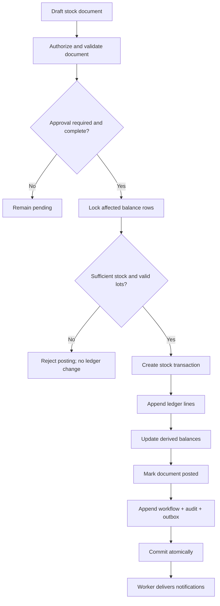

# MA Next MariaDB database design

## Target and non-goals

The authoritative target is MariaDB accessed through Prisma ORM using Prisma's `mysql` datasource provider. The design must not connect migrations, tests, or application development to the production PHP database. Existing MariaDB Prisma configuration aligns with the target; duplicate Drizzle or direct SQL persistence paths require an approved consolidation.

This is a logical design pending sanitized legacy DDL, volumes, constraints and data profiling. It intentionally does not claim exact source column mappings.

## MariaDB conventions

| Concern | Design |
|---|---|
| Naming | `snake_case` table/column/index names; singular Prisma models may map to plural tables |
| IDs | proposed application-generated time-sortable UUIDs; exact UUID version requires ADR approval |
| Tenant ownership | non-null `tenant_id` on every customer-owned row, including join/history/outbox rows |
| Time | `DATETIME(3)` in UTC; retain source timezone/offset metadata because MariaDB `DATETIME` does not preserve it |
| Money | `numeric(19,4)` plus ISO currency code; never floating point |
| Quantity | `numeric(19,6)` with unit code; approved unit conversions only |
| Human codes | separate document number with tenant/type/period uniqueness and atomic sequence allocation |
| Text | `utf8mb4` text/varchar with an explicitly approved collation; canonical codes use normalized companion columns or binary/case-sensitive uniqueness where required |
| State | Prisma/MariaDB enum or constrained canonical code only for code-governed workflow states; configurable classifications use foreign keys |
| Concurrency | `version` integer for optimistic concurrency on edited aggregates; row locks for posting/sequence allocation |
| Deletion | archive/retire operational masters; restrict deletion when referenced; histories and posted ledgers are append-only |

## Tenant isolation

Every repository method requires a trusted `TenantContext`; callers cannot request unscoped access by omitting a tenant. Unique constraints include tenant scope, for example `(tenant_id, code)` and `(tenant_id, source_system, source_table, source_id)`.

Foreign keys should include tenant consistency where practical, using composite candidate keys such as `(tenant_id, id)` and composite references. Prisma/MariaDB support and migration ergonomics must be prototyped before finalizing this technique. MariaDB does not provide native row-level security policies, so tenant isolation relies on mandatory server authorization, tenant-scoped repositories, composite database constraints, least-privilege database accounts, and isolation tests.

Global reference data, if any, is explicitly modeled and read-only to tenants rather than represented by nullable `tenant_id` scattered across domain tables.

## Logical schema families

### Identity and organization

- `tenants`, `organizations`, `sites`, `departments`, `employees`
- `users`, Auth.js-compatible `accounts`, `sessions`, `verification_tokens`
- `roles`, `permissions`, `role_permissions`, `user_role_assignments`
- `login_events`, `password_history` only if local credentials remain approved

Role assignments include exactly one approved scope descriptor (`TENANT`, `ORGANIZATION`, `SITE`, `DEPARTMENT`) and the corresponding scope ID. Database checks plus application validation reject invalid combinations.

### Configuration

- `master_data_types`, `master_data_values`, `master_data_value_translations`
- `settings` with typed key registry, scope, JSON value and schema version
- `number_sequences`, `number_allocations`
- `custom_field_definitions`, `custom_field_definition_translations`, `asset_custom_values`

Arbitrary executable SQL, model/table names, and unvalidated JSON are prohibited. Each setting/custom field key has an owning module and Zod/domain validator.

### Asset and maintenance

- `assets`, `asset_types`, `asset_hierarchy_paths` if closure-table strategy is approved
- `asset_parts`, `asset_meters`, `condition_rules`, `condition_events`
- `maintenance_notifications`, `notification_reviews`
- `work_orders`, `work_tasks`, `work_tools`, `work_labor`, `work_parts`, `work_completions`, `work_verifications`
- `preventive_maintenance_programs`, `pm_program_tasks`, `pm_occurrences`
- `workflow_transitions`, `workflow_instances`, `approval_definitions`, `approval_steps`, `approval_decisions`

Use a dedicated source-link table with a unique `(tenant_id, source_type, source_id)` key to ensure at most one work order is generated for a notification/event/PM occurrence. This avoids relying on conditional unique-index behavior that MariaDB does not natively provide.

### Inventory and commercial

- `items`, `inventory_locations`, `stock_documents`, `stock_document_lines`
- `stock_transactions`, `stock_ledger_lines`, `stock_balances`, optional `stock_lots`
- `vendors`, `contracts`, `contract_assets`, `contract_cost_events`

`stock_transactions` and `stock_ledger_lines` are immutable after posting. A correction references the original transaction and posts reversing/adjusting lines. `stock_balances` is updated transactionally as a projection and can be rebuilt/reconciled from ledger data.

### Platform

- `attachments`, `attachment_links`, `attachment_versions` if versioning is approved
- `audit_events`
- `notifications`, `notification_recipients`, `notification_deliveries`
- `outbox_messages`, `jobs`, `job_attempts`
- `legacy_id_maps`, `migration_batches`, `migration_rejections`, `reconciliation_results`

## Inventory persistence rules

1. Lock affected item/location/lot balance rows in deterministic order.
2. Validate document state, idempotency key, tenant scope and available stock policy.
3. Create a posting transaction and all ledger lines.
4. Update balance projections from the posted lines.
5. Mark the stock document posted and record its transaction ID.
6. Write workflow history, audit event and outbox message in the same database transaction.
7. A unique `(tenant_id, idempotency_key)` prevents duplicate posting.

No API, form, migration or administrator action may set on-hand quantity directly. Opening balances are posted as explicit migration/opening transactions.

## Inventory transaction flow

## Constraints and indexes

Minimum constraints/indexes include:

- tenant-scoped unique codes and document numbers;
- unique legacy crosswalk per source coordinate;
- unique source-to-work-order conversion and PM occurrence keys;
- workflow history indexes on `(tenant_id, entity_type, entity_id, occurred_at)`;
- asset search indexes for code/KKS, normalized name, site, type, status and parent;
- notification/work-order indexes for status, priority, assignee, asset and planned dates;
- ledger indexes on item/location/posted time, source document, transaction and lot;
- notification recipient indexes on recipient/unread/created time;
- audit indexes on tenant/time, actor, target and correlation ID;
- job/outbox indexes on status/available time with safe worker-claim semantics;
- check constraints for non-negative planned quantities and valid date ordering where business policy is known.

Use MariaDB `FULLTEXT` indexes, normalized search columns, or an approved external search service only after representative data and multilingual search requirements establish the need. Collation and Thai tokenization behavior require explicit tests.

## Prisma boundaries

- Prisma Client is infrastructure, never imported by React Client Components or domain modules.
- Repositories expose purpose-specific methods and always accept tenant context.
- Application services own `$transaction` boundaries; repositories do not silently open nested business transactions.
- Raw SQL is limited to reviewed migrations, locking/claim patterns Prisma cannot express safely, reconciliation, and registered reporting read models. It is parameterized, tenant-scoped and tested.
- Prisma migrations are immutable after shared deployment. Production uses `prisma migrate deploy`, never `db push`.
- Schema changes use expand/migrate/contract sequencing when zero-downtime coexistence is required.

## Audit, outbox and transaction coupling

Important domain rows, workflow transition, audit event, and outbox event must commit together. External object/email/push operations occur after commit through workers; their delivery attempts are recorded separately. Attachment metadata creation and domain linking are transactional after object validation succeeds.

Audit and workflow tables reject application-level update/delete except approved retention/cryptographic erasure procedures. Database privileges should separate migration owner, application writer, read-only reporting, and operational support roles.

## Backup, retention and privacy

- Define point-in-time recovery objectives and coordinate MariaDB full backups and binary logs with object-storage versioning/retention.
- Encrypt in transit and at rest through platform controls; secrets never enter database configuration rows.
- Personal data and IP/user-agent data require classification, retention, access, export and deletion policy.
- Audit/ledger records that must remain immutable may retain pseudonymous actor IDs when user personal data is erased, subject to legal approval.
- Partitioning audit, notification, telemetry-evidence or ledger tables is deferred until volume estimates justify it.

## Legacy migration separation

Migration staging uses a separate MariaDB database unavailable to normal application roles. Raw sanitized extracts, transformation tables, rejections and crosswalks never become core domain tables. Migration scripts may read staged copies only and may write only target MariaDB.

See [migration-plan.md](./migration-plan.md) for extraction, reconciliation and cutover controls.

## Database decisions requiring approval

The central approval register is in [target-architecture.md](./target-architecture.md#architecture-decisions-requiring-approval). Database-specific decisions are ADR-002 through ADR-005, ADR-013, ADR-014, ADR-018, ADR-020 and ADR-021. In addition, approve the MariaDB version/collation/SQL mode, hierarchy storage, tenant-constraint strategy, job-claim mechanism, lot/serial dimensions, unit conversion, sequence reset rules, archive/delete policy, optimistic-lock conflict UX, partition thresholds, and recovery objectives before migrations are designed.
