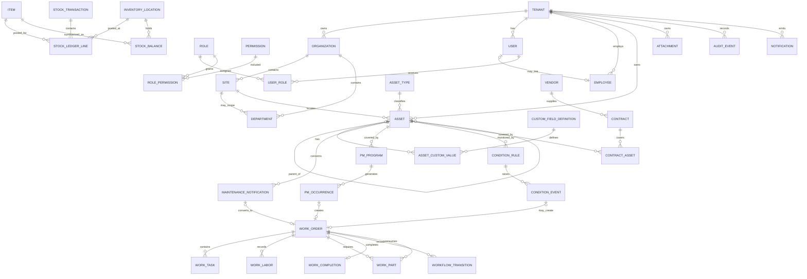

# MA Next domain model

## Modeling principles

The model is organized around business aggregates rather than legacy table prefixes. Legacy identifiers are retained in migration crosswalks, not used as target domain names. This document proposes boundaries and invariants; unresolved functional behavior remains `NEEDS_CONFIRMATION` in the baseline.

- Every tenant-owned aggregate has `tenant_id` and is accessed through an authorized tenant context.
- `User` is an authentication principal. `Employee` is an organizational/personnel record. Either may exist without the other until business policy says otherwise.
- Canonical codes are language-neutral and stable; labels are localized/configurable.
- References across aggregates use IDs and application services. An aggregate does not directly mutate another aggregate.
- Status changes use centralized transition services and append workflow history.
- Important mutations create structured audit events in the same transaction.
- Posted inventory is represented by ledger transactions, never direct quantity edits.

## Domain relationships

## Bounded contexts and aggregate roots

| Context | Aggregate roots | Primary invariants |
|---|---|---|
| Tenant and organization | Tenant, Organization, Site, Department, Employee | codes unique within tenant/parent scope; inactive scope cannot accept new operational records without approved override |
| Identity and access | User, Role | credentials isolated from Employee; role assignment scope must be valid and contained by tenant |
| Master data | MasterDataType, MasterDataValue, CustomFieldDefinition | stable code uniqueness; inactive values remain readable on historical records |
| Asset | Asset, AssetType | tenant/site ownership; hierarchy cannot cross tenant; cycle/orphan policy requires approval |
| Maintenance intake | MaintenanceNotification | required asset/context and defaults; review is single authoritative transition; conversion is idempotent |
| Work management | WorkOrder | tasks gate completion; verification gates close; history records every state transition |
| Maintenance programs | PreventiveMaintenanceProgram, ConditionRule | only due/enabled definitions generate occurrences; source occurrence is idempotently linked to at most one work order |
| Inventory | Item, StockDocument, StockTransaction | posted transactions are balanced, append-only, idempotent and sufficient-stock checked according to approved policy |
| Commercial | Vendor, Contract | coverage dates and asset links are explicit; work-order completion updates only through a registered use case |
| Workflow and approval | WorkflowInstance, ApprovalDefinition | only allowed transitions; exactly one active decision per step; typed conditions only |
| Platform | Attachment, Notification, AuditEvent, NumberSequence, Job | private ownership, deduplication, retention and tenant isolation |

## Core entities

### Tenant and organization

| Entity | Purpose | Important attributes |
|---|---|---|
| Tenant | isolation and customer configuration boundary | id, code, default locale, timezone, status |
| Organization | legal/operating organization within tenant | tenant_id, code, name, status |
| Site | physical/operational site | tenant_id, organization_id, code, name, timezone override |
| Department | organizational unit, optionally site-scoped | tenant_id, organization_id, site_id?, parent_id?, code, name |
| Employee | worker/personnel record | tenant_id, employee_no, names, department_id, position/status master IDs, user_id? |
| User | login principal | tenant_id, username/email, credential/session status; no HR entitlement fields |

Tenant membership semantics, cross-tenant administrators, employee uniqueness, and inactive-scope rules require approval.

### Configurable master data

`MasterDataType` defines a governed list such as priority, asset status, maintenance type, unit, cause, problem, solution, escalation, position, or vendor status. `MasterDataValue` stores a stable code, localized labels, sort order, active dates, optional parent, and typed metadata validated by the owning module.

Do not use master data as an untyped escape hatch for entities with lifecycle or behavior. Workflow states and permission codes are code-governed because they control invariants, while their labels and selected mappings are configurable.

Asset-type custom fields use:

- `CustomFieldDefinition`: tenant, owning entity type, optional asset type, stable key, data type, unit, required flag, validation constraints, localized labels, order and active state.
- `AssetCustomValue`: asset, definition, and one typed value representation. The service validates type and definition applicability.

Changing a definition must not reinterpret historical values silently.

### Asset

`Asset` is the register root with legacy fields preserved through explicitly mapped columns, custom values, or an approved legacy-extension record. It includes code/KKS, name, type/category/status, criticality, site/location, department/owner, parent, manufacturer/model/serial, commissioning/service dates, cost/contract references, description, and lifecycle metadata.

Related entities include hierarchy closure/path support if approved, asset parts/BOM, contract coverage, meters/tags, condition rules/events, attachments, and legacy ID crosswalks. Parent-child hierarchy and stock BOM are distinct relationships.

### Maintenance notification

`MaintenanceNotification` captures reported work against an asset with source, type, severity/priority, breakdown flag, reported dates, reporter/contact, responsible department/manager, description, status, and attachment links.

`NotificationReview` records reviewer, decision, note, timestamp, and version. Conversion to `WorkOrder` uses a unique source link or idempotency key so retries cannot create duplicates.

### Work order

`WorkOrder` owns planning and execution state, source notification/event, asset, type/priority, requested/planned/actual dates, responsible scope, assignee, vendor/contract/project links, and human document number.

Children:

- `WorkTask`: ordered job steps and completion state.
- `WorkTool`: required/used tool references.
- `WorkStage` or `WorkflowTransition`: append-only state/history record.
- `WorkInformation`: typed work facts that are not custom-field definitions.
- `WorkLabor`: employee/vendor labor, dates, duration and cost inputs.
- `WorkPart`: planned/reserved/issued/used item quantities; stock movement remains owned by Inventory.
- `WorkCompletion`: actual completion time, cause/problem/solution/escalation, close notes and readings.
- `WorkVerification`: supervisor decision, note and timestamp.

The authoritative close/reopen/cancel transition table requires business approval.

### Preventive and condition-based maintenance

`PreventiveMaintenanceProgram` defines asset scope, plan, recurrence, timezone, generation lead time, tasks/tools/parts, ownership, and active period. Each evaluated due date becomes an immutable `PMOccurrence` with a unique program/scheduled-time key. An occurrence links to at most one work order.

`ConditionRule` maps an asset/meter/tag to typed threshold logic. `ConditionEvent` records observed value, unit, quality, occurred time, deduplication window, acknowledgment, and source evidence. Telemetry remains external; MA Next stores the decision evidence necessary to explain generation.

### Inventory

`Item` owns identity, type/category, units, reorder/max/lifetime settings and active status. `InventoryLocation` is site/tenant scoped. `StockBalance` is a derived performance projection per item/location/lot dimension, not the source of truth.

`StockDocument` represents issue, receipt, transfer or adjustment workflow. Posting creates one `StockTransaction` with one or more immutable `StockLedgerLine` entries. Each line records direction, quantity, unit cost, amount, location, lot/source linkage, item, occurred/posted timestamps and actor. Transfers create paired source/destination lines under one transaction.

Costing, negative stock, returns, unit conversion, lot/serial scope, and correction policy require approval before inventory implementation.

### Vendor, contract and warranty

`Vendor` holds supplier identity and contact/status data. `Contract` owns contract number, vendor, dates, status, commercial/warranty terms and attachments. `ContractAsset` links covered assets with coverage dates and optional limits. Contract work/cost updates are domain actions, not direct updates from the Work Order repository.

### Cross-cutting records

- `Attachment` owns object metadata and lifecycle; `AttachmentLink` associates it with an allow-listed entity type and ID.
- `AuditEvent` is append-only and stores actor, action, target, request, result and redacted structured change data.
- `Notification` describes a localized event; `NotificationRecipient` owns per-recipient read/archive/delivery state.
- `WorkflowTransition` records aggregate state changes; `ApprovalDecision` separately records ordered human decisions.
- `LegacyIdMap` maps source system/table/ID to target entity/ID and migration batch.
- `OutboxMessage` and `Job` provide durable post-commit delivery and scheduled work.

## Domain event catalog

Initial stable event names include `maintenance_notification.created`, `maintenance_notification.reviewed`, `work_order.created`, `work_order.state_changed`, `work_order.completed`, `work_order.verified`, `work_order.closed`, `pm_occurrence.due`, `stock_document.approved`, `stock_transaction.posted`, `attachment.available`, and `contract.coverage_updated`.

Event payloads contain IDs, tenant, event version and minimum routing facts—not full records, secrets, binary content, or translated prose. Event names are not permission codes and do not authorize consumers.

## Legacy mapping boundaries

| Legacy root | Target aggregate |
|---|---|
| `user`, `user_profiles`, HR tables | User plus optional Employee and organizational masters |
| `asast010`, `asbom010/020`, `ascnf*`, `asmet*` | Asset and related typed submodels |
| `wonof010/020` | MaintenanceNotification plus NotificationReview |
| `woord010` and children | WorkOrder aggregate and execution children |
| `wopvm*`, `asast030/031` | PreventiveMaintenanceProgram/Occurrence and condition/event records |
| `whitm010/012`, `whinv010/020`, document triplets | Item, InventoryLocation, StockDocument, StockTransaction/LedgerLine |
| `whvnd*`, `ascnt*` | Vendor and Contract |
| `sys_approve*` | typed Workflow/Approval definitions and histories |
| `sys_log*`, `sys_notifications`, file tables | AuditEvent, Notification, Attachment |

Mappings preserve source identifiers in `LegacyIdMap`; they do not preserve unsafe dynamic SQL, weak tokens, MD5 password history, or known defects as domain behavior.

## Domain decisions requiring approval

The central register is [target-architecture.md](./target-architecture.md#architecture-decisions-requiring-approval). Domain modeling specifically depends on ADR-004, ADR-005, ADR-013, ADR-014, ADR-016, ADR-023, ADR-024, ADR-025, ADR-026 and ADR-028, plus approved canonical workflow mappings and master-data ownership.
