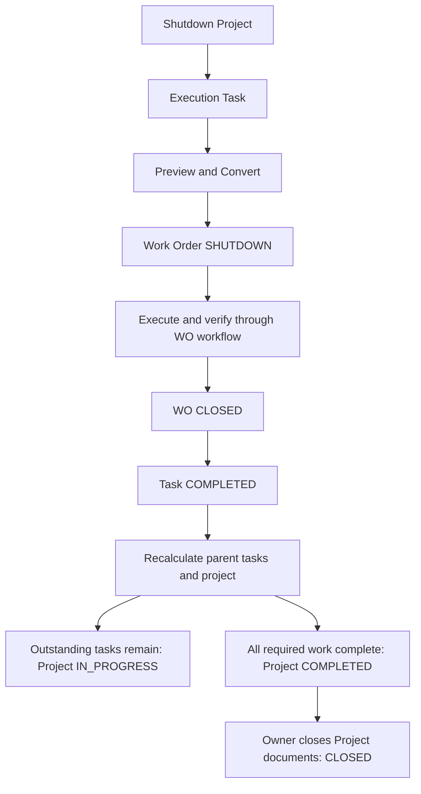

# แผนพัฒนา Preventive Maintenance และ Shutdown Project Management

วันที่จัดทำ: 5 กันยายน 2026  
ระบบเป้าหมาย: `ma-next`  
สถานะ: ลงมือพัฒนาแล้วบางส่วน — core workflow ทดสอบบน DEV แล้ว แต่ยังไม่ครบทั้งแผนและยังไม่ deploy ชุดใหม่นี้ขึ้น Production

เป้าหมายหลัก: สร้างแผน PM และบริหาร Shutdown เป็น Project ที่มี Tasks โดย Task สามารถ Convert เป็น Work Order และเมื่อปิด Work Order ระบบอัปเดต Task และสถานะ Project อัตโนมัติ

สถานะลงมือทำและสิ่งที่ยังค้าง: [Implementation status / rollout gates](./pm-shutdown-implementation-status.md) — checklist ด้านล่างถือว่าเสร็จเมื่อครบเกณฑ์ทั้งข้อ ไม่ใช่เพียงมีโค้ดบางส่วน

## 1 ขอบเขตและหลักฐาน

แผนนี้เติมความสามารถที่ขาดในสองโมดูลข้างต้นและจุดเชื่อมกับ Work Order, Asset, Inventory, Approval และรายงานที่เกี่ยวข้อง ไม่ใช่รายการช่องว่างทุกโมดูลของระบบ

แหล่งอ้างอิง:

- คู่มือ [PowerExMA_Manual.docx](/Users/rattananair/Library/CloudStorage/Dropbox/Work/AET/maintenance/PowerExMA_Manual.docx) หัวข้อ Preventive → Schedule, PM Event, Project → All, การเพิ่ม Tasks และการเพิ่ม Asset; สารบัญระบุ Preventive เริ่มหน้า 34 ใช้ข้อความและตารางที่สกัดจาก DOCX เป็นหลัก ไม่อนุมานรายละเอียดปุ่มที่มีเฉพาะในภาพ
- [Functional baseline](./functional-baseline.md) รายการ PM-001, PM-002, OUT-001 และ OUT-002
- [Work Order traceability](./work-order/work-order-traceability.md) รายการ WO-005 และ WO-006
- ระบบเดิม [Wopvm010Controller.php](../../aes02/controllers/Wopvm010Controller.php) และ [GeneventController.php](../../aes02/commands/GeneventController.php): PM events และการสร้าง WO
- ระบบเดิม [Pjprj010Controller.php](../../aes02/controllers/Pjprj010Controller.php), [Pjprj020Controller.php](../../aes02/controllers/Pjprj020Controller.php): Project, Task/Subtask, Board และ Gantt
- ระบบเดิม [Woord010Controller.php](../../aes02/controllers/Woord010Controller.php) `actionConvert` และ [Woord030Controller.php](../../aes02/controllers/Woord030Controller.php): แปลง Task และอัปเดต Task/Project เมื่อ WO เสร็จ

คู่มือกล่าวถึง Project ภายใต้ Preventive ด้วย จึงต้องแยก PM template/project ที่ใช้ซ้ำออกจาก Shutdown Project ซึ่งเป็นงานจริงในช่วงเวลาหนึ่ง ห้ามย้าย `wopvm*` และ `pjprj*` เข้าตารางเดียวกันเพียงเพราะใช้คำว่า Project เหมือนกัน

กติกาสถานะ โครงสร้างใหม่ และ API ด้านล่างเป็นข้อเสนอสำหรับการพัฒนา ส่วน requirement ที่ผู้ใช้กำหนดชัดคือ Task → Convert WO → ปิด WO → อัปเดต Task/Project

## 2 สิ่งที่มีแล้วและช่องว่าง

| ความสามารถ | หลักฐานปัจจุบัน | งานที่ต้องเพิ่ม |
|---|---|---|
| ประเภท WO | มี `PREVENTIVE`, `SHUTDOWN` และ source `PREVENTIVE_EVENT`, `SHUTDOWN_TASK` | ตรวจสอบ source จริงและเชื่อม record แบบมีข้อบังคับในฐานข้อมูล |
| สร้าง WO | `lib/work-orders/service.ts` รับ source และ sourceRecordId จากแบบฟอร์ม; schema มี unique `(sourceType, sourceRecordId)` แล้ว | Dedicated conversion/generation commands, mapping, source validation, scope และ snapshot |
| PM Schedule | คู่มือมี Asset, Event Type, Action, Project, Recur Every, Day/Week/Month, Start/Expire Date และ Priority | หน้า/API/model สำหรับ Schedule และการคำนวณรอบ |
| PM Template | ระบบเดิมมี Tasks, Asset steps, เวลา, ผลลัพธ์ และไฟล์ | Versioned template และการคัดลอกเข้า WO |
| PM Event | คู่มือมี Planned Outage, Preventive, Unplanned Outage | Occurrence, Calendar, preview, generation history และ retry |
| Shutdown Project | ระบบเดิมมี Project/Task, Gantt/Board | Model, service, API, UI, timeline และสิทธิ์ในระบบใหม่ |
| Task → WO | ระบบใหม่มีเพียงช่องอ้างอิง source | Conversion ที่สร้าง WO และ backlink สำเร็จพร้อมกัน |
| WO → Task → Project | ปัจจุบัน close service เชื่อม Notification แต่ยังไม่มี Project callback | Transactional synchronization และ project roll-up |
| ปิด WO | มี `closeWorkOrder` และ `closeGovernedWorkOrder` | Shared source-completion hook ที่ถูกเรียกจากทุกเส้นทางปิดงาน |

## 3 เป้าหมายการทำงาน

### 3.1 Preventive Maintenance

1. Planner สร้าง PM Template พร้อม Tasks, ขั้นตอนตาม Asset, Checklist, อะไหล่, เครื่องมือ, แรงงานประมาณการ และเอกสาร
2. สร้าง PM Program เลือก Asset, Template, Event Type, Priority, ผู้รับผิดชอบ, วันเริ่ม/สิ้นสุด และรอบ Day/Week/Month
3. ระบบแสดงวันที่ที่จะเกิดงานให้ตรวจสอบก่อนเปิดใช้งาน
4. Scheduler หรือ Planner สร้าง occurrence ตามกำหนดและ Generate WO โดยคัดลอก template version ณ เวลานั้น
5. ติดตาม Upcoming, Due, Missed, Generated, Completed, Skipped และ Failed ได้จากรายการ/ปฏิทิน
6. เมื่อ WO เป็น `CLOSED` อัปเดต occurrence เป็น `COMPLETED` พร้อมวันที่ปิดจริงและข้อมูลอ้างอิง

### 3.2 Shutdown Maintenance ในรูปแบบ Project Management

1. สร้าง Project ระบุ code, name, site, owner, shutdown window, description และ priority
2. แตกงานเป็น Task/Subtask ระบุ Asset, ผู้รับผิดชอบ, วันเริ่ม/สิ้นสุด, เวลาประมาณการ, Checklist, เอกสาร และงานก่อนหน้า
3. แต่ละ execution Task มีปุ่ม `Convert to Work Order` เมื่อข้อมูลและสิทธิ์พร้อม
4. แสดง preview ข้อมูลที่จะสร้าง; หลัง Convert แสดงปุ่ม `Open Work Order` และลิงก์ย้อนกลับจาก WO ไป Task/Project
5. ช่างทำงานผ่าน workflow WO เดิม รวมถึงตรวจรับและอนุมัติที่ใช้กับงานนั้น
6. เมื่อ WO ปิดสำเร็จ Task เป็น `COMPLETED`; ระบบคำนวณ Parent Task และ Project ใหม่ทันที
7. Task สุดท้ายเสร็จแล้ว Project เปลี่ยนเป็น `COMPLETED` อัตโนมัติ; การปิดเอกสาร Project เป็น `CLOSED` แยกต่างหาก

## 4 กติกา Task และการ Convert

- Execution Task หนึ่งรายการมี WO ได้หนึ่งรายการในรุ่นแรก ห้ามสร้างซ้ำจากการดับเบิลคลิก retry หรือผู้ใช้สองคนทำพร้อมกัน
- Summary Task เป็นตัวรวม Subtasks และ Milestone เป็นจุดตรวจ จึงไม่ Convert โดยตรง งานที่ต้องออก WO ให้สร้างเป็น execution Task ใต้ Summary; ทุก execution Task รองรับการ Convert
- ห้ามเปลี่ยน execution Task ที่มี WO แล้วเป็น Summary หรือเพิ่มลูกให้กลายเป็นกลุ่มงาน เพื่อป้องกันการนับงานซ้ำ
- เงื่อนไข Convert: Project อยู่ `PLANNED` หรือ `IN_PROGRESS`, Task อยู่ `READY`, มี Active Asset และข้อมูลผู้รับผิดชอบ/แผนเวลา/ขอบเขตองค์กรครบ, ไม่มี WO, ไม่ถูกยกเลิก
- อนุญาตวาง WO ล่วงหน้าแม้งานก่อนหน้ายังไม่เสร็จ แต่บล็อกการเริ่มทำงานจน predecessor สำเร็จ รุ่นแรกใช้ Finish-to-Start และต้องป้องกัน dependency cycle
- ตรวจว่า Asset, Project, Task, assignee และข้อมูลที่เชื่อมอยู่ใน organization/site scope ที่อนุญาต
- ห้ามให้ client ระบุ `SHUTDOWN_TASK` หรือ `PREVENTIVE_EVENT` กับ ID อิสระผ่าน generic create เพื่อข้าม conversion service
- บันทึก WO, source link, Task backlink, history และ audit ใน transaction เดียวกัน หากส่วนใดล้มเหลวต้อง rollback ทั้งหมด
- หลัง Convert ใช้ snapshot ของรายละเอียด Checklist และไฟล์อ้างอิงแบบมี version; การแก้ template ไม่แก้ WO ที่สร้างแล้ว
- การแก้ Task หลัง Convert ไม่เปลี่ยนแผน WO เงียบ ๆ ให้แก้ผ่าน WO planning command และบันทึกการเปลี่ยนแผนที่ Project

| ข้อมูล Task | ข้อมูล WO |
|---|---|
| ID | `sourceRecordId`; `sourceType=SHUTDOWN_TASK` |
| ประเภทงาน Shutdown | `workType=SHUTDOWN` |
| Name / Description | Title / Description |
| Primary Asset | `assetId` |
| Priority / Department / Crew / Assignee / Supervisor | ฟิลด์ความสำคัญและผู้รับผิดชอบที่ตรงกัน |
| Planned start / finish / estimate | วันเริ่ม/เสร็จตามแผนและ estimated minutes |
| Steps / Checklist / Materials / Tools / Documents | Child records หรือ immutable version references ของ WO |
| Project / Task code | Source breadcrumb และลิงก์กลับที่ตรวจสิทธิ์ |

## 5 สถานะและการอัปเดตอัตโนมัติ

### 5.1 Task

สถานะที่เสนอ: `DRAFT`, `READY`, `WO_CREATED`, `IN_PROGRESS`, `BLOCKED`, `WAITING_COMPLETION`, `COMPLETED`, `CANCELLED`

| เหตุการณ์ WO | ผลกับ Task |
|---|---|
| Convert สำเร็จ | `WO_CREATED` |
| Accept assignment | คง `WO_CREATED`; การรับมอบหมายยังไม่ถือว่าเริ่มปฏิบัติงาน |
| Start/Resume | `IN_PROGRESS` ตาม state mapping ที่กำหนด |
| Backlog/Waiting/On hold | `BLOCKED` พร้อมเหตุผลและสถานะ WO จริง |
| ส่งผล/รอตรวจ/ตรวจแล้ว/รอ acceptance | `WAITING_COMPLETION` ยังไม่ถือว่าเสร็จ |
| Return/Reject/Recheck | `IN_PROGRESS` หรือ `BLOCKED` ตามผล transition |
| `CLOSED` | `COMPLETED`, actual finish และ closed WO reference |
| `CANCELLED` | `BLOCKED` พร้อมเหตุผล WO cancelled; ไม่ยกเลิก Task หรือถือว่างานสำเร็จอัตโนมัติ |

กำหนด mapping แบบ exhaustive สำหรับสถานะ WO ทุกตัวที่มีจริงใน `lib/db/schema.ts` และสอง workflow ที่มีอยู่ ทดสอบให้สถานะใหม่ที่ยังไม่มี mapping ถูกตรวจพบ ไม่ fallback เป็น Completed

### 5.2 Project และ Parent Task

สถานะ Project ที่เสนอ: `DRAFT`, `PLANNED`, `IN_PROGRESS`, `ON_HOLD`, `COMPLETED`, `CLOSED`, `CANCELLED`

- นับเฉพาะ execution leaf Tasks และ Milestones ที่ต้องทำ ไม่บวก Summary Task ซ้ำ รุ่นแรกทุก Task เป็น required; งานที่ถอดจาก scope ต้อง Cancel อย่างมีเหตุผล ไม่มี optional execution Task ที่เปิด WO ค้างแล้วปล่อยให้ Project complete
- `progressPercent = completed required items / non-cancelled required items × 100` โดย Milestone ต้องมีหลักฐานการยืนยันเสร็จ; แสดง cancelled count แยก
- ไม่มีรายการหรือยกเลิกทั้งหมด: progress เป็น 0 และไม่ auto-complete Project
- เมื่อมีงานเริ่มแล้วและยังมีรายการค้าง: Project เป็น `IN_PROGRESS`; หากมีรายการ Blocked ให้แสดงจำนวนและ risk indicator
- เมื่อทุกรายการที่ต้องทำสำเร็จและมีอย่างน้อยหนึ่งรายการที่เสร็จ: Project เป็น `COMPLETED`; actual finish คือเวลาสำเร็จล่าสุดของรายการที่ต้องทำ
- Parent Task คำนวณจากลูกด้วยกติกาเดียวกัน แล้วคำนวณขึ้นไปจนถึง Project
- `ON_HOLD` ต้องคงไว้จน Owner สั่ง Resume แม้ progress ถูกคำนวณใหม่; ตอน Resume ให้ประเมินว่าเป็น `IN_PROGRESS` หรือ `COMPLETED`
- `CLOSED` และ `CANCELLED` ห้าม roll-up เปลี่ยนกลับเงียบ ๆ และห้ามมี WO เปิดค้างเมื่อเข้าสู่สถานะเหล่านี้
- Owner ปิด Project จาก `COMPLETED` เป็น `CLOSED` ได้เมื่อ closure summary และเอกสารจำเป็นครบ
- หากเพิ่ม scope ให้ Project ที่ `COMPLETED` ให้ใช้คำสั่ง reopen/replan พร้อมเหตุผลก่อนเพิ่ม Task; Project `CLOSED` ต้องมีสิทธิ์ reopen โดยเฉพาะ

### 5.3 ความถูกต้องเมื่อปิด WO

สร้าง shared source hook เช่น `syncMaintenanceSource(tx, workOrder, transition)` และเรียกภายใน transaction ของทั้ง `closeWorkOrder` และ `closeGovernedWorkOrder` รวมทุก endpoint ที่มาถึงสอง service นี้ ห้ามย้ายการตรวจรับของ workflow เดิมออกไป

ล็อกตามลำดับเดียวกันทั้ง conversion และ close เช่น Project → ancestor Tasks → execution Task → WO; serialize roll-up ต่อ Project เพื่อให้ WO สองใบสุดท้ายปิดพร้อมกันแล้ว Project สำเร็จถูกต้อง รองรับ bounded retry เมื่อ deadlock และ optimistic version สำหรับคำสั่งจากหน้าเว็บ

WO, Task, Parent และ Project ต้อง commit/rollback พร้อมกัน ส่วน notification ใช้ transactional outbox แล้วส่งหลัง commit; การส่ง notification ล้มเหลวไม่ทำให้ข้อมูลสถานะตกหล่น มี unique event key กันประมวลผลซ้ำ

Reopen WO ไม่ใช่ความสามารถที่ยืนยันว่ามีแล้ว หากเพิ่มภายหลังต้องย้อนสถานะ Task และคำนวณ Project ใหม่ใน transaction เดียวกัน และห้าม reopen WO ใต้ Project `CLOSED` โดยไม่ reopen Project อย่างมีสิทธิ์ก่อน รุ่นแรกไม่เปิดสร้าง replacement WO อัตโนมัติหลัง cancel; Planner เลือกยกเลิก Task อย่างมีเหตุผลหรือสร้าง replacement Task ที่อ้างอิงงานเดิม

## 6 กติกา PM Schedule และ Generation

- รุ่นแรกใช้ calendar recurrence Day/Week/Month ตามคู่มือ; usage meter และ CBM เป็นงานต่อยอดที่ต้องมีข้อมูล meter/condition ก่อน
- เก็บ timezone ต่อ Program ค่าเริ่มต้นจาก Site; คำนวณ local schedule แล้วเก็บเวลา UTC สำหรับ occurrence
- วันเริ่ม/สิ้นสุดเป็นขอบเขตตาม local date; monthly วันที่ 29–31 ให้ clamp เป็นวันสุดท้ายของเดือนและรักษาวัน anchor เดิมในเดือนถัดไป
- เก็บ `leadTimeDays`; วัน due เป็นวันตามแผน ส่วน WO generation อาจเกิดล่วงหน้า
- Unique occurrence key ประกอบด้วย organization, program, asset และ scheduled timestamp; retry ต้องได้ occurrence/WO เดิม
- Generation ต้องใช้ source type `PREVENTIVE_EVENT` และบังคับ link กับ occurrence จริง
- Preview และ Run ใช้ schedule evaluator เดียวกัน พร้อม template version และ program revision เพื่อไม่ให้ผลต่างกันโดยไม่แจ้ง
- ค่าเริ่มต้นเมื่อขาดรอบ: แสดง `MISSED` ให้ Planner preview/select catch-up หรือ Skip พร้อมเหตุผล ไม่สร้าง WO ย้อนหลังจำนวนมากทันทีหลัง scheduler กลับมาทำงาน
- Program ที่ pause/expire ไม่สร้างรอบใหม่; WO ที่สร้างแล้วดำเนินการต่อได้
- การแก้ schedule มี effective date และ version; ไม่เปลี่ยน occurrence ที่สร้าง WO แล้ว ไม่ทิ้งประวัติ skipped/missed เดิม
- Event Type `Planned Outage`, `Preventive`, `Unplanned Outage` จากคู่มือเป็นข้อมูลประเภท event แยกจาก work type; เก็บ mapping ชัดเจนก่อน migrate ไม่แปลงทุก event เป็น Shutdown Project อัตโนมัติ
- PM Project ในคู่มือเสนอให้เป็น reusable template bundle; การนำ bundle ไปสร้าง Shutdown Project ใช้ explicit copy action เพื่อไม่เกิดทั้ง PM WO และ Shutdown WO สำหรับงานเดียวกันโดยไม่ตั้งใจ

## 7 โครงสร้างข้อมูลที่เสนอ

| Entity | ข้อมูลหรือข้อบังคับหลัก |
|---|---|
| `MaintenanceTemplate` / `MaintenanceTemplateVersion` | Code, name, description, version, Tasks/Steps/Checklist/Resources/Documents |
| `PreventiveMaintenanceProgram` | Organization/site, Asset, template version, event type, interval, unit, timezone, start/expiry, lead time, owner, active/revision |
| `PMOccurrence` | Program, Asset, scheduledAt, status, template snapshot/version, generation error, generatedAt/completedAt; unique schedule key |
| `PMGenerationRun` / Run items | Actor/job ID, requested window, started/finished, counts, occurrence results/errors |
| `MaintenanceProject` | Type `SHUTDOWN`, code, owner, site, shutdown window, status, progress, planned/actual dates, baseline revision, version |
| `MaintenanceProjectTask` | Project, parent, kind, code, Asset, assignee, dates, estimate, status, cancellation reason, version |
| `ProjectTaskDependency` | Predecessor/successor, Finish-to-Start; same-project scope and no cycle |
| `MaintenanceWorkOrderSourceLink` | Organization, source type/source ID, WO ID; unique source key และ unique WO ID สำหรับ primary source |
| `ProjectEvent` / `TaskEvent` | Actor, before/after, reason, linked WO, event key, timestamp |
| `MaintenanceOutboxEvent` | Unique event key, delivery state, attempts และ last error |

Source link ควรมี nullable explicit FK `pmOccurrenceId` และ `projectTaskId` พร้อม exactly-one rule แทนการพึ่ง string ID อย่างเดียว ตรวจการบังคับ constraint กับ MariaDB รุ่นที่ใช้งานจริง; `sourceType/sourceRecordId` ที่ WO เก็บเป็นข้อมูลอ้างอิงที่ต้องสอดคล้องกันและไม่ให้แก้แยก

ตรวจ schema parity ระหว่าง `prisma/schema.prisma`, `lib/db/schema.ts`, migration และ compatible migration runner ตามแนวทางของ repository ทุก entity ต้องมี organization/site scope, created/updated actor และ timestamp ตามมาตรฐานที่มีอยู่

## 8 หน้าจอ API และสิทธิ์

### 8.1 หน้าจอ

- `/preventive-maintenance/programs`: filter Asset/site, active, due/missed; create/edit/pause program
- `/preventive-maintenance/programs/[id]`: Schedule preview, template, occurrences, linked WO และ history
- `/preventive-maintenance/calendar` และ `/preventive-maintenance/runs`: ปฏิทินและผล Generate แบบรายรายการ
- `/maintenance-templates`: Template, versions และ preview steps/resources
- `/projects`: List/Board ของ Shutdown Projects พร้อม owner, window, progress และ blocked count
- `/projects/[id]`: Overview, Tasks/WBS, Board, Gantt, Work Orders, Resources, Documents และ History
- Task detail: dependency, Asset, assignee, checklist, Convert preview หรือ Open WO
- WO detail: Project/Task หรือ PM occurrence breadcrumb, planned vs actual และ source history

`/projects` เป็นเส้นทางหลักเดียวสำหรับ Shutdown Project Management; filter ด้วย type แทนสร้าง `/outages` ซ้ำอีกชุด เอกสาร baseline ที่เสนอ `/outages` ต้องอัปเดต mapping ให้สอดคล้องเมื่อเริ่ม implementation

### 8.2 API ที่เสนอ

| API | หน้าที่ |
|---|---|
| `GET/POST /api/projects` | รายการและสร้าง Project |
| `GET/PATCH /api/projects/:id` | รายละเอียดและแก้ข้อมูล ไม่รับ direct status |
| `POST /api/projects/:id/commands/:command` | Plan, start, hold, resume, close, cancel, reopen |
| `GET/POST /api/projects/:id/tasks` | อ่านและสร้าง Tasks |
| `PATCH /api/project-tasks/:id` | แก้ข้อมูลที่อนุญาตพร้อม version |
| `POST /api/project-tasks/:id/convert-preview` | Validate และแสดง WO payload ที่จะสร้าง |
| `POST /api/project-tasks/:id/convert-to-work-order` | Atomic conversion พร้อม idempotency key |
| `POST /api/project-tasks/:id/commands/:command` | Ready, cancel, complete milestone ตามสิทธิ์ |
| `GET/POST /api/preventive-maintenance/programs` | รายการและสร้าง Program |
| `GET/PATCH /api/preventive-maintenance/programs/:id` | รายละเอียดและแก้ Program |
| `POST /api/preventive-maintenance/programs/:id/preview` | วันที่ตาม Schedule และผล catch-up |
| `POST /api/preventive-maintenance/generation-runs` | Manual generation แบบมีขอบเขตและผลรายรายการ |
| Internal scheduler command | ใช้ generation service เดียวกัน พร้อม service identity |

เพิ่ม permission families เช่น `PROJECT_READ`, `PROJECT_MANAGE`, `PROJECT_TASK_CONVERT`, `PROJECT_CLOSE`, `PROJECT_REOPEN`, `PM_READ`, `PM_MANAGE`, `PM_GENERATE` โดยผูกกับ permission registry จริงตอน implement ผู้ Convert ต้องมีทั้งสิทธิ์ Task และสร้าง WO; ช่างใช้สิทธิ์ WO ตามเดิม ไม่จำเป็นต้องมีสิทธิ์แก้ Project เพราะ roll-up เป็นผลของคำสั่งปิดงานที่ตรวจสิทธิ์แล้ว

## 9 ลำดับพัฒนาและจุดตรวจรับ

จัดส่ง Shutdown workflow ที่ผู้ใช้ต้องการก่อน แล้วใช้ source integration เดียวกันต่อยอด PM ไม่มีการกำหนดวันส่งตายตัวก่อนประเมิน migration และ UI กับข้อมูลจริง

| ช่วง | งานหลัก | ขึ้นกับ | ผลที่ต้องตรวจรับ |
|---|---|---|---|
| A | ยืนยัน field/status mapping, inventory ทุก close route, contract tests และ schema design | ไม่มี | Mapping ชัดเจน, เลือก workflow ปิด WO สำหรับ Shutdown ที่ไม่มี Notification ได้ |
| B | Project/Task/dependency schema, migration, scope, CRUD และ Task list | A | สร้าง Project และ Tasks พร้อมสิทธิ์/แผนเวลาได้ |
| C | Convert preview/command, source link uniqueness, child snapshots | B | Task → WO และ backlink สำเร็จพร้อมกัน; concurrent convert ไม่ซ้ำ |
| D | Shared completion hook, task/project roll-up, outbox และ cancellation rules | C | ปิด WO แล้ว Task/Project ถูกต้องจากทุก close route รวม concurrent close |
| E | Shutdown Overview, Board/Gantt, baseline comparison, documents และรายงาน | D | Planner ติดตามทั้งโปรเจกต์และไล่ถึง WO ได้ |
| F | PM Template/Program, recurrence preview, occurrence schema และ Calendar | A, C | Day/Week/Month และ template version ถูกต้อง |
| G | PM Scheduler/manual run, retry/catch-up, PM completion callback และ metrics | D, F | Generate WO ครั้งเดียวต่อ occurrence และติดตามจนปิดได้ |
| H | Legacy migration dry-run, reconciliation, UAT และ rollout | E, G | ข้อมูลสัมพันธ์ตรงต้นทางและผ่าน scenario ทางธุรกิจ |

### Checklist ลงมือพัฒนา

- [ ] A1 ตรวจ close routes ทั้ง `/api/work-orders`, `/api/maintenance/work-orders` และ governed workflow พร้อมเลือก transitions สำหรับ WO ที่ไม่มี Notification
- [ ] A2 ระบุ fields และ validation ของ Project/Task/PM พร้อมตัวอย่างข้อมูลตามคู่มือ
- [ ] B1 เพิ่ม schema, migration, indexes และ source-link constraints
- [ ] B2 เพิ่ม Project/Task service, permissions, API และหน้า list/detail
- [ ] B3 เพิ่ม hierarchy, milestone และ dependency validation
- [ ] C1 แยก internal WO creation helper ที่รับ transaction และไม่ข้าม authorization ของ command
- [ ] C2 Implement conversion พร้อม scope, idempotency, snapshot และ source backlink
- [x] C3 ปิด generic create bypass สำหรับ managed PM/Shutdown sources
- [ ] D1 เพิ่ม shared source hook ในทั้งสอง close service และ lifecycle commands ที่มีผลต่อ Task
- [ ] D2 เพิ่ม deterministic lock order, roll-up, concurrent tests และ outbox
- [ ] D3 เพิ่ม project close/cancel/replan และ policy เมื่อ WO ถูกยกเลิก
- [ ] E1 เพิ่ม Board/Gantt, source navigation, planned/actual และ project history
- [ ] F1 เพิ่ม Template version และ PM Program CRUD
- [ ] F2 เพิ่ม recurrence evaluator, preview, occurrence และ missed/skip handling
- [ ] G1 เพิ่ม bounded scheduler/manual runs, dedupe และ run logs
- [ ] G2 เพิ่ม occurrence completion hook และ PM compliance report
- [ ] H1 ทำ migration dry-run/reconciliation และ seed UAT fixtures
- [ ] H2 รัน tests ที่เกี่ยวข้อง, lint, typecheck, build และ database validation
- [ ] H3 อัปเดต functional traceability และบันทึกผล UAT ก่อนเปิดใช้

## 10 Migration และการเปิดใช้งาน

- Map `wopvm010/020/021/022/023` และ `asast030` เป็น Program/Template/Occurrence ตามความสัมพันธ์ที่ตรวจจากข้อมูลจริง
- Map `pjprj010/020/021/022/023` เป็น Project/Task และข้อมูลประกอบ; ตรวจ tables อื่นที่เก็บ status/priority/milestone/files เพิ่มก่อนย้าย
- เก็บ legacy table/ID, original status/type และ source timestamps เพื่อย้อนตรวจได้
- รหัสสถานะ numeric ของระบบเดิม เช่น 3 และ 5 ต้องเทียบ status master จริง ไม่ hard-code จากตัวเลขอย่างเดียว
- ตรวจ dangling task→WO links: `actionConvert` ที่ตรวจพบมีการกำหนด `woord010_id` บน Task แต่ไม่พบ `save()` ในบล็อกนั้น จึงไม่ใช้การมี conversion code เป็นหลักฐานว่าทุก link ถูกบันทึกสมบูรณ์
- Dry-run รายงาน counts, duplicate sources, missing Assets, orphan links, invalid dates, timezone และ cancelled/completed mapping
- Import แบบ idempotent; ย้ายรายการที่ปิดแล้วโดยรักษาประวัติ ไม่เรียก live callback หรือส่ง notification ย้อนหลัง
- แยก historical reconciliation จากการคำนวณสถานะ live และรายงานความต่างก่อนแก้ข้อมูล
- เปิดใช้เป็น module/site feature flag; จัด maintenance window สำหรับสลับ scheduler ให้มี producer เดียวและกำหนด cutoff timestamp ป้องกันระบบเก่า/ใหม่สร้าง WO ซ้ำ
- หาก rollback ให้หยุด generation ใหม่ก่อน รักษา WO/Task ที่เกิดแล้วและ source ledger; ไม่ลบข้อมูลหรือเปิด scheduler เก่าทับช่วงที่สร้างไปแล้ว

## 11 Acceptance scenarios

| ID | Scenario | ผลคาดหวัง |
|---|---|---|
| SD-01 | Project มี 3 execution Tasks; Convert Task แรก | ได้ WO SHUTDOWN หนึ่งใบและ link ไปกลับถูกต้อง |
| SD-02 | สองคน Convert Task เดียวกันพร้อมกัน | มี WO หนึ่งใบ; อีกคำขอได้ WO เดิมหรือ conflict ที่ชัดเจน ไม่มี orphan |
| SD-03 | Task ข้าม site/organization หรือผู้ใช้ไม่มีสิทธิ์ | ปฏิเสธโดยไม่สร้าง WO/child records |
| SD-04 | WO อยู่ COMPLETION_PENDING/VERIFIED หรือรอ acceptance | Task ยังไม่ COMPLETED |
| SD-05 | ปิด WO แรกจาก 3 Tasks | Task แรก COMPLETED, Project ยัง IN_PROGRESS, progress ประมาณ 33.33% |
| SD-06 | ปิด WO สุดท้ายหลังทุกรายการอื่นเสร็จ | Parent Tasks และ Project COMPLETED ใน transaction เดียว |
| SD-07 | สอง WO สุดท้ายปิดพร้อมกัน | Project COMPLETED ถูกต้อง ไม่มี lost roll-up |
| SD-08 | Task update หรือ audit ล้มเหลวระหว่าง close | WO/Task/Project rollback ทั้งชุด |
| SD-09 | retry close/callback เดิม | ไม่บวก progress ซ้ำ ไม่สร้าง event/notification ซ้ำ |
| SD-10 | ยกเลิก WO | Task BLOCKED พร้อมเหตุผล; ไม่ทำให้ Project สำเร็จ |
| SD-11 | Project ว่างหรือทุก Task cancelled | ไม่ auto-complete และแสดง progress 0 |
| SD-12 | Parent/child และ Milestone | ไม่นับ Summary ซ้ำ และต้องผ่าน Milestone ก่อน Project complete |
| SD-13 | Predecessor ยังไม่เสร็จหรือ dependency เป็นวงจร | วาง WO ล่วงหน้าได้แต่เริ่มไม่ได้; reject cycle |
| SD-14 | ปิดจาก close API ทุกเส้นทางที่รองรับ | เรียก hook เดียวกันและคงการตรวจรับ/คืนเครื่องมือของ workflow ที่เกี่ยวข้อง |
| SD-15 | Project ON_HOLD ขณะ WO สุดท้ายปิด | progress เปลี่ยนแต่ Project คง ON_HOLD; Resume แล้วประเมินสถานะใหม่ |
| PM-01 | รายเดือน anchor วันที่ 31 ข้ามกุมภาพันธ์ | Clamp ถูกต้องและเดือนถัดไปกลับวันที่ 31 |
| PM-02 | Schedule มี start/expiry/timezone/lead time | Preview และ generation ให้ผลตรงกันตามขอบเขต |
| PM-03 | Scheduler ซ้ำหรือ worker ล้มหลัง commit | มี occurrence และ WO อย่างละหนึ่งต่อรอบ |
| PM-04 | แก้ Template หลังสร้าง WO | WO เดิมคง snapshot/version เดิม |
| PM-05 | Pause/expire และ missed catch-up | ไม่สร้างรอบใหม่โดยผิดนโยบาย; skip/catch-up มีเหตุผลและ history |
| PM-06 | ปิด WO ที่มาจาก PM | Occurrence COMPLETED พร้อมวันที่จริงและรายงานถูกต้อง |
| MIG-01 | Import ซ้ำและเทียบ source links | ไม่เพิ่ม duplicate; รายงาน unresolved links โดยไม่เดาความสัมพันธ์ |

ใช้ unit tests สำหรับ recurrence/mapping/roll-up, MariaDB integration tests สำหรับ transaction/constraints/concurrency และ E2E สำหรับ Planner → Technician → Reviewer → Close WO → Project update พร้อม regression งาน Corrective ที่มีอยู่

## 12 ขอบเขตรุ่นแรกและงานต่อยอด

รุ่นแรกครอบคลุมหนึ่ง WO ต่อ execution Task, Project/Task/Subtask, milestone, dependency Finish-to-Start, basic Board/Gantt, auto completion, PM calendar recurrence และ source-safe generation ตามแผนข้างต้น

งานต่อยอดหลังเส้นทางหลักผ่าน UAT: meter-based PM/CBM, critical path และ resource leveling, หลาย WO ต่อ Task, replacement/reopen workflow ที่สมบูรณ์, budget control/earned value และ advanced shutdown resource allocation งานเหล่านี้ต้องมี model และข้อมูลรองรับเพิ่มเติม

Definition of Done: ผู้ใช้สร้าง Shutdown Project, Convert execution Tasks เป็น WO, ทำงานและปิดผ่าน workflow ที่กำหนด แล้วเห็น Task/Project อัปเดตถูกต้องทันที; PM สร้าง WO ตามรอบได้โดยไม่ซ้ำ; tests และ migration reconciliation ผ่าน พร้อมเอกสาร traceability ที่สะท้อน implementation จริง

## 13 ช่องโหว่และความเสี่ยงจากโค้ดปัจจุบัน

ผลต่อไปนี้เป็น static review ของเส้นทางที่เกี่ยวข้อง ไม่ใช่ผล penetration test หรือการยืนยันว่าเกิดเหตุใน production ระดับ P1 หมายถึงควรจัดการก่อนเปิด conversion/generation ใหม่ ส่วน P2 จัดการก่อน UAT เต็มรูปแบบ

| ID | ระดับ | หลักฐานและสิ่งที่พบ | ผลกระทบ | งานแก้ไขในแผน |
|---|---|---|---|---|
| GAP-01 | P1 | `lib/work-orders/service.ts:createWorkOrder` ตรวจสิทธิ์ทั่วไปและ Active Asset แต่ไม่ตรวจว่า PM/Shutdown source มีอยู่จริง; validation ตรวจเพียง source ID ไม่ว่าง | ผู้มีสิทธิ์สร้าง WO สามารถผูก source ID ที่ไม่ใช่งานของตนหรือไม่มีจริง; unique key อาจถูกจองก่อน legitimate conversion | บังคับใช้ dedicated source commands, ตรวจ source/scope ใน transaction และปิด generic source bypass |
| GAP-02 | P1 | `createWorkOrder` query Asset เฉพาะ status; ไม่พบการตรวจ Asset scope และไม่ใส่ organizationId/siteId ใน insert; POST route ตรวจเพียง `MANAGE_WORK_ORDERS` | เสี่ยงสร้างงานให้ Asset นอก scope และได้ WO ที่ขาดข้อมูลขอบเขตจนค้นหา/เข้าถึงไม่ตรงสิทธิ์ | Derive scope จาก source/Asset ที่เชื่อถือได้, ตรวจ assignee/department/resource IDs และบันทึก scope โดย server; เพิ่ม negative tests |
| GAP-03 | P1 | มี close services สองชุด: ชุดแรกตรวจคืนเครื่องมือ ส่วน governed close ตรวจ operator acceptance/recheck; API มีหลายเส้นทาง | เพิ่ม callback เพียงจุดเดียวแล้วบางงานไม่ sync; เสี่ยงเงื่อนไขปิดงานต่างกัน | จัด closure policy ตาม workflow ที่ record กำหนด, shared invariant checks และ source hook; client เลือก API เพื่อเปลี่ยน policy ไม่ได้ |
| GAP-04 | P1 | `lib/maintenance/service.ts:orderForMutation` อ่าน record โดยไม่พบ row lock/version guard ใน helper; close update ใช้ ID เป็นเงื่อนไข | สองคำสั่งที่ใช้สถานะเก่าอาจทับกัน และ roll-up ที่เพิ่มใหม่อาจผิด | ตรวจสถานะ/สิทธิ์ซ้ำภายใน transaction, lock/CAS, deterministic lock order และ concurrent transition tests |
| GAP-05 | P2 | `lib/db/schema.ts` มี `work_orders_source_uq(sourceType, sourceRecordId)` อยู่แล้ว แต่ source เป็น string ไม่มี FK ไป Task/Occurrence | กัน ID ซ้ำได้แต่ไม่รับรอง source จริง; legacy ID ที่ซ้ำข้ามองค์กรอาจชน | Reconcile existing records ก่อนเพิ่ม source-link table; ใช้ scoped/global identity ที่ชัดเจนและรักษา uniqueness เดิมระหว่าง migration |
| GAP-06 | P2 | Generic creation เรียก notification หลัง transaction และ catch/log error; governed route เรียก alert หลัง service commit | อาจเกิดงานแล้วแต่ผู้รับไม่เห็น notification หรือ retry หลังผลตอบกลับผิดพลาด | Transactional outbox, delivery retry, idempotent command response และ UI reload สถานะจริง |
| GAP-07 | P2 | ระบบเดิม `actionConvert` กำหนด Task WO ID แต่ไม่พบ save ในบล็อก conversion ที่ตรวจ | Legacy backlink อาจไม่ครบและย้ายผิดความสัมพันธ์ | ตรวจข้อมูลจริง; บันทึก unresolved links และ manual reconciliation ไม่เดา link จากชื่อคล้ายกัน |

สิ่งที่ยังต้องพิสูจน์ก่อนจัดว่าเป็นช่องโหว่จริง: effective permission ของแต่ละ role, middleware/DB constraints ที่อาจป้องกันบางกรณี, การเข้าถึง endpoint บน deployment และพฤติกรรม concurrency บน MariaDB จริง การทดสอบใช้ fixture/test database โดยไม่แก้ข้อมูล production

## 14 ช่องว่างของแผนที่ต้องเติมก่อนเขียนฟีเจอร์

1. **Workflow สำหรับ Shutdown ที่ไม่มี Notification** — กำหนด reviewer/operator จาก Project/Site และ policy ที่บันทึกไว้ใน WO ตั้งแต่สร้าง ห้ามให้ Task แปลงแล้วติดอยู่ใน workflow ที่ต้องมี Notification หรือใช้ route ที่ตรวจน้อยกว่าเพื่อปิด
2. **ยกเลิก Task ที่มี WO** — ห้าม Cancel Task โดยตรงเมื่อ WO ยังเปิด; ให้จัดการ WO ผ่าน cancellation command ก่อน แล้ว Owner จึงยกเลิก Task พร้อมเหตุผลและประวัติ ไม่ cascade cancel Project ลงไปลบงานจริง
3. **ขอบเขต shutdown window** — ตรวจ start ≤ finish และ planned dates ของ Tasks อยู่ใน window; งานเตรียม/งานหลัง shutdown ให้มี phase `PREPARATION`, `SHUTDOWN`, `RESTORATION` อย่างชัดเจน งานนอก window ต้องมีเหตุผลและ replan event
4. **การคืนเครื่องสู่การใช้งาน** — Project complete เป็นผลรวมงาน ไม่ใช่หลักฐานว่าเครื่องพร้อมเดินระบบ ต้องมี restoration/acceptance Milestone ที่ผู้รับผิดชอบยืนยัน หาก Project นั้นกำหนดเงื่อนไขนี้
5. **ข้อมูลอะไหล่และต้นทุน** — คัดลอก planned materials จาก Template ไม่เท่ากับเบิกสต็อก; ใช้ Inventory reservation/issue ที่มีอยู่และตรวจ integration จริงก่อนคำนวณ actual cost ป้องกันการตัดสต็อกหรือบันทึกค่าใช้จ่ายซ้ำตอน roll-up
6. **เอกสารและ attachment** — Copy ต้องผ่านสิทธิ์อ่านต้นทาง, version/reference ที่คงอยู่ได้ และสิทธิ์อ่านปลายทาง; ไม่คัดลอก public URL หรือเปิดให้ Task reader อ่านไฟล์ WO ที่ไม่มีสิทธิ์
7. **PM ที่เปลี่ยนกำหนดขณะ generation ทำงาน** — Lock/check program revision ตอน claim occurrence; หาก preview ล้าสมัยให้แสดง conflict และ preview ใหม่ก่อนสร้างงาน
8. **PM missed และ generation failed** — แยก schedule status ออกจาก execution status: `MISSED` หมายถึงรอบที่ยังไม่ได้สร้างงานตามนโยบาย; WO ที่สร้างแล้วแต่เลย due คือ overdue WO ไม่สร้าง occurrence ซ้ำเพื่อแก้สถานะ
9. **Job runner และขนาด batch** — ระบุ execution environment ของ scheduler จริง, service identity, lease/expiry, maximum batch/runtime และ recovery; HTTP route เพียงอย่างเดียวไม่ใช่ scheduler
10. **Bulk convert/generate** — จำกัดจำนวนรายการ, validate ต่อรายการ, ส่งผลสำเร็จ/ล้มเหลวที่ชัดเจน; ใช้ transaction ต่อ Task/Occurrence ไม่ล็อกทั้ง shutdown project หลายร้อยงานตลอด batch
11. **Project baseline และ scope change** — เก็บ baseline revision พร้อม planned dates/estimate เพื่อรายงานความคลาดเคลื่อน; Cancel Task ลด denominator จึงต้องแสดง scope removed และ progress ตาม baseline คู่กับ current scope
12. **การซ่อมสถานะไม่ตรงกัน** — เพิ่ม read-only reconciliation report สำหรับ WO CLOSED แต่ Task ไม่ complete และ Project roll-up ผิด; repair command ต้องมีสิทธิ์, dry-run และ audit ไม่แก้เงียบขณะเปิดหน้า Project

## 15 สิ่งที่ไม่ควรทำ

- ไม่ถือว่ามี enum, dropdown หรือหน้า marketing แล้วเท่ากับมี PM/Shutdown module ครบ
- ไม่ให้ frontend เปลี่ยน Task/Project เป็น Completed เองหลังได้รับผล close; database/service เป็นแหล่งสถานะที่เชื่อถือได้
- ไม่ใช้ progress 100% ที่ผู้ใช้กรอกเป็นเงื่อนไขปิด Project และไม่ใช้ `VERIFIED` แทน `CLOSED` โดยข้าม closure policy
- ไม่ใช้ชื่อ Task, timestamp หรือการ disable ปุ่มเป็นวิธีหลักป้องกัน WO ซ้ำ ต้องมีฐานข้อมูลบังคับ uniqueness
- ไม่สร้าง WO ให้ Summary Task และ Subtasks พร้อมกันจนการนับความก้าวหน้าและทรัพยากรซ้ำ
- ไม่ให้ callback ทำ HTTP เรียกตัวเองเพื่อเปลี่ยน Project และไม่ส่ง notification/เรียกบริการภายนอกระหว่างถือ DB locks
- ไม่ hard-delete Project/Task/Source link ที่มี WO ประวัติการทำงานหรือเอกสารอ้างอิง
- ไม่เปิด scheduler สองระบบทับช่วงเดียวกัน และไม่เปิด auto catch-up ย้อนหลังไม่จำกัดหลัง downtime
- ไม่ให้การแก้ PM Template เปลี่ยน Checklist/ขั้นตอนของ WO ที่กำลังทำอยู่
- ไม่อาศัย global ADMIN bypass เพื่อทำให้ tests ผ่านโดยไม่ทดสอบ Planner/Technician ที่มี scope จริง
- ไม่เขียน completion rules สองชุดเพิ่มในแต่ละโมดูล ให้ reuse WO workflow และ source synchronization กลาง
- ไม่เริ่มด้วย critical-path engine, microservices หรือ event sourcing ทั้งระบบก่อน conversion/closure/roll-up ที่จำเป็นทำงานครบ

## 16 แนวทางทำให้ใช้งานและดูแลได้ดีขึ้น

| ลำดับ | การปรับปรุง | ประโยชน์และเกณฑ์ตรวจรับ |
|---|---|---|
| ก่อนเปิดใช้ | หน้า readiness ของ Task ระบุข้อมูลขาดเป็นรายการและลิงก์ไปแก้ | Planner ทราบว่าทำไม Convert ไม่ได้ ไม่เจอเพียงปุ่ม disabled |
| ก่อนเปิดใช้ | แสดง last synced state, Task/WO links และ timeline เดียวกัน | ไล่สาเหตุสถานะได้โดยไม่ต้องเปิด database |
| ก่อนเปิดใช้ | Metrics ของ duplicate conflicts, conversion failures, roll-up failures, scheduler lag และ outbox age | ผู้ดูแลเห็นความผิดปกติพร้อม record/run ID ที่ตรวจต่อได้ |
| ก่อนเปิดใช้ | กำหนดขอบเขตทดสอบขนาด Project/Task/Occurrence จากข้อมูลจริง | Pagination/lazy loading และ Gantt ไม่โหลดทั้งฐานข้อมูล |
| หลัง workflow หลัก | Bulk preview พร้อม select เฉพาะ Task ที่พร้อม | ลดงานซ้ำของ Planner แต่ยังเห็นผลต่อรายการ |
| หลัง workflow หลัก | Copy shutdown project/template เป็นรอบใหม่แบบ preview | ใช้แผนเดิมซ้ำโดย reset actuals/status/WO links และเลือกวันใหม่ |
| หลัง workflow หลัก | มุมมอง critical upcoming work และ blocked dependencies | เห็นงานที่กระทบกำหนด shutdown ก่อนเพิ่ม scheduling engine เต็มรูปแบบ |
| หลังข้อมูลต้นทุนพร้อม | แสดง planned vs actual hours/cost และ baseline/current scope | วัดผลการวางแผนโดยไม่นับค่าใช้จ่ายจาก WO ซ้ำ |

เพิ่ม security/robustness acceptance tests: source ID ปลอม, ID ข้าม scope, assignee ไม่มีสิทธิ์, attachment ข้าม scope, stale preview, close-vs-cancel พร้อมกัน, Task cancel ขณะ WO เปิด, scheduler lease หมดอายุ, outbox retry และการเปลี่ยน schedule ระหว่าง generation

ปรับลำดับงานช่วง A ให้ปิด GAP-01 ถึง GAP-04 และกำหนด closure policy ก่อนช่วง C–D; ข้อ 1–12 ในหัวข้อ 14 เป็นรายละเอียดที่ต้องรวมใน spec ของแต่ละช่วง ไม่ใช่งานเพิ่มท้ายโครงการ ส่วน enhancement หลัง workflow หลักเลื่อนได้โดยไม่ทำให้ requirement Task → WO → Project ขาด
