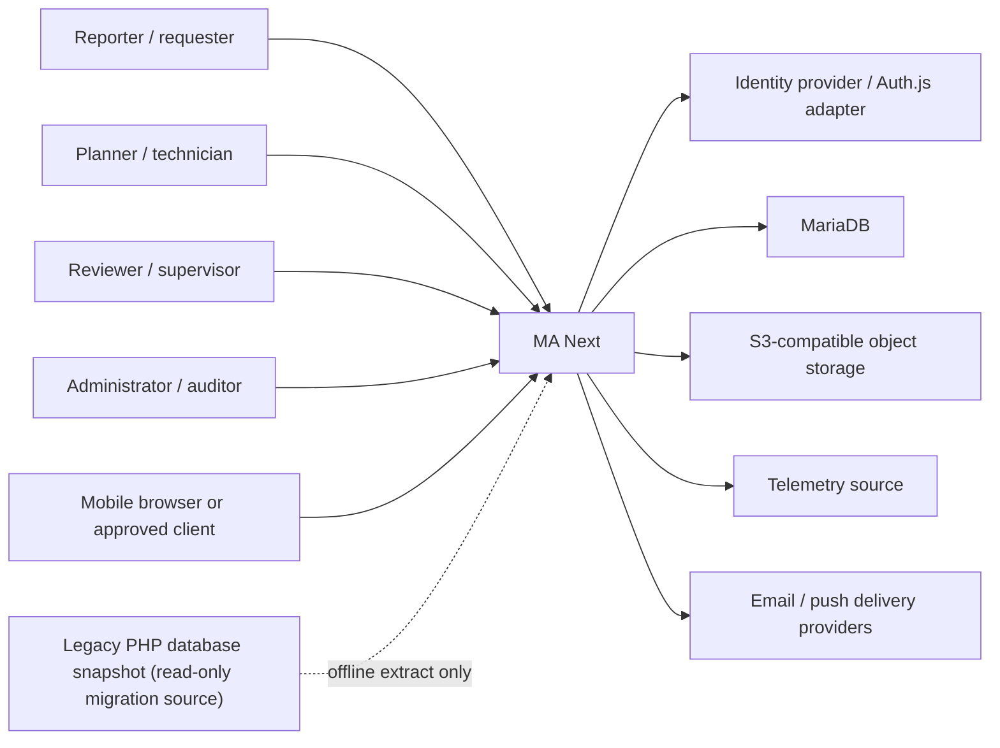
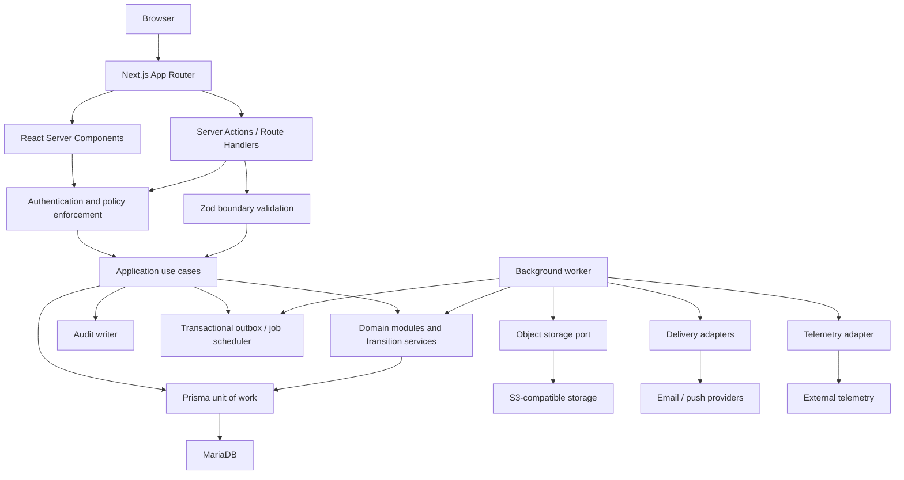

# MA Next target architecture

## Status and scope

This document is the proposed target architecture for MA Next. It is based on the approved legacy discovery documents and [functional baseline](./functional-baseline.md). It defines structure and constraints; it does not authorize implementation or resolve items marked `NEEDS_CONFIRMATION`.

MariaDB and Prisma are the target persistence stack. Prisma uses its `mysql` provider for MariaDB. Existing Drizzle or duplicate provider-specific persistence paths in `ma-next` are transition debt and are not target architecture. The production PHP database remains read-only throughout discovery, migration rehearsal, and cutover preparation.

## Architectural style

Use a modular monolith with separately runnable web and worker processes from one TypeScript codebase. This provides transactionally consistent workflows without prematurely distributing asset, maintenance, approval, inventory, audit, and notification behavior.

The dependency direction is:

`UI → application use cases → domain model → ports ← infrastructure adapters`

- React Server Components load authorized view models; Client Components handle interaction only.
- React components never contain workflow, costing, numbering, authorization, or other core business logic.
- Route Handlers and Server Actions authenticate, authorize, validate with Zod, and call application use cases.
- Application use cases coordinate transactions, domain services, audit records, and outbox events.
- Domain modules own invariants and legal state transitions.
- Prisma repositories, Auth.js, S3, email/push, telemetry, and clock/ID providers implement ports.
- Background work uses a dedicated worker and a durable MariaDB job/outbox design until a separate broker is justified.

## System context



## Application components



## Domain modules

| Module | Owns | May depend on |
|---|---|---|
| Identity | User, account status, sessions, credentials | audit, notification |
| Organization | Tenant, organization, site, department, employee | identity, master data |
| Authorization | permissions, roles, scoped assignments, policy evaluation | identity, organization, audit |
| Asset | asset register, hierarchy, type-specific fields, asset parts | organization, master data, attachments |
| Maintenance intake | maintenance notification and review | asset, organization, workflow, notification |
| Work management | work order, tasks, labor, diagnosis, execution and close | asset, inventory references, contracts, workflow |
| Maintenance programs | preventive programs, due occurrences, condition events | asset, work management, telemetry adapter |
| Inventory | item, location balance, immutable transaction ledger, documents | organization, approval, work references |
| Commercial | vendor, contract, warranty | asset, organization, attachments |
| Workflow | centralized transition definitions and approval execution | authorization, audit, notification |
| Platform | master data, numbering, attachments, audit, notifications, localization, jobs | organization/tenant scope |
| Reporting | allow-listed queries and document renderers | read models from owning modules |

Cross-module writes occur through application use cases or domain events handled within the same database transaction. Modules do not update another module's tables directly.

## Request and mutation lifecycle

1. Resolve tenant from the trusted host/session context; never accept an unrestricted `tenant_id` from form input.
2. Authenticate with Auth.js or an approved equivalent.
3. Load user, scoped role assignments, and employee context when needed.
4. Authorize the action on the server against permission, tenant, organization/site/department, and resource context.
5. Parse and validate untrusted input with Zod. React Hook Form may mirror the schema for UX but is not authoritative.
6. Execute one application use case in a Prisma transaction.
7. Let the centralized workflow service validate state transitions and invariants.
8. Write the domain change, audit event, and outbox messages atomically.
9. Return a typed success/error result with a correlation ID; never expose internal exceptions or secrets.

Queries follow the same authentication, tenant resolution, and authorization boundary. Page visibility and navigation filtering are convenience features, not security controls.

## Runtime topology and Docker services

| Service | Responsibility | Persistent data |
|---|---|---|
| `web` | Next.js UI, Server Actions, Route Handlers, Auth.js endpoints | none locally |
| `worker` | outbox delivery, scheduled PM/CBM jobs, file scanning orchestration, migration jobs | none locally |
| `mariadb` | authoritative transactional database | Docker volume in local/test only |
| `object-storage` | local S3-compatible service such as MinIO | Docker volume in local/test only |
| `object-storage-init` | idempotently creates local buckets and policies | none |
| `mail-catcher` | captures local/test email; never used in production | optional local data |

Production should use a managed MariaDB-compatible service and S3-compatible storage unless infrastructure approval selects self-hosting. Docker Compose is a reproducible local/integration environment, not the production topology specification.

## Next.js structure

The intended layout is a design constraint, not a request to create these files yet:

```text
app/                    route segments, layouts, RSC pages, route-local UI
components/             reusable presentation components only
features/<module>/      form schemas, view models, presentation adapters
server/application/     use cases and transaction orchestration
server/domain/          aggregates, value objects, policies, transitions
server/infrastructure/  Prisma repositories and external adapters
server/platform/        authz, audit, attachments, outbox, logging, i18n
prisma/                 MariaDB schema, migrations, seed
tests/                  unit, integration, contract, e2e, migration parity
```

Import rules must prevent `server/*` from entering client bundles and prevent `server/domain` from importing React, Next.js, Prisma, or provider SDKs.

## Target route groups

| Route group | Purpose |
|---|---|
| `/(public)/login` | unauthenticated sign-in only |
| `/(app)/dashboard` | authorized landing/read models |
| `/(app)/assets/**` | asset register and hierarchy |
| `/(app)/maintenance/notifications/**` | notification intake and review |
| `/(app)/maintenance/work-orders/**` | planning, execution, completion, verification and close |
| `/(app)/maintenance/programs/**` | PM and condition configurations |
| `/(app)/inventory/**` | item, balances, ledger and stock documents |
| `/(app)/vendors/**`, `/(app)/contracts/**` | commercial records |
| `/(app)/reports/**` | allow-listed module reports |
| `/(app)/admin/**` | users, roles, master data, audit and configuration |
| `/api/auth/**` | Auth.js or equivalent endpoints |
| `/api/v1/**` | versioned integrations only; not an alternate business-logic path |
| `/api/internal/jobs/**` | authenticated operational callbacks only if required |

## Configuration and localization

- Environment variables hold deployment coordinates and secrets, never customer policy values.
- Customer values such as statuses, thresholds, document formats, approval routes, timezones, enabled modules, and localized labels live in tenant-scoped configuration/master data.
- Stable application permission and event codes may be code-defined; their role assignments and display text remain configurable.
- Store timestamps as UTC `DATETIME(3)` values; MariaDB does not retain an offset in that type, so evaluate schedules with the tenant/site IANA timezone and preserve source offset/timezone metadata when required.
- Support `th-TH` and `en` from the beginning, including message catalogs, locale-aware dates/numbers, and report fonts. Store canonical codes separately from translated labels.

Proposed environment variable families are `DATABASE_URL`, `AUTH_SECRET`, trusted application URL/host settings, S3 endpoint/region/bucket/access credentials, mail/push provider settings, telemetry adapter settings, log level, and worker controls. Exact names and secret delivery are approved during implementation planning.

## Reliability, security, and observability

- Deny by default; use server-side authorization for reads and mutations.
- Use database transactions, unique idempotency keys, optimistic concurrency where competing edits are plausible, and a transactional outbox.
- Use structured JSON logs with correlation, tenant, actor, use-case, and outcome identifiers; redact credentials, tokens, personal data, and attachment contents.
- Expose health/readiness checks for the web, worker, database, and required adapters.
- Apply timeouts, bounded retries with jitter, and dead-letter visibility to external delivery and telemetry operations.
- Back up MariaDB and object storage consistently; enable and test the approved binary-log point-in-time recovery procedure.
- Do not execute configurable SQL or dynamic model/table names. Reports, approval predicates, and numbering strategies must be allow-listed implementations.

## Architecture conformance gates

- ESLint/import-boundary tests enforce layer direction and server-only modules.
- Every mutation test proves authorization, Zod rejection, state validation, audit creation, and tenant isolation.
- Workflow tests call the same transition service used by UI, API, and workers.
- Inventory tests reconcile ledger lines to balances; direct quantity mutation is prohibited.
- Attachment tests use the storage port, not provider SDK calls from domain/application code.
- Migration tests run only against disposable MariaDB databases and sanitized legacy extracts.

## Architecture decisions requiring approval

| Decision | Proposed choice | Why approval is required |
|---|---|---|
| ADR-001 Target shape | Modular monolith with separate web and worker processes | Establishes deployment and module boundaries. |
| ADR-002 Database | MariaDB is the sole target using Prisma's `mysql` provider; retire duplicate Drizzle persistence paths | Confirms the target engine/version and requires consolidation of existing persistence paths. |
| ADR-003 ORM | Prisma only for application persistence; reviewed SQL allowed for migrations/reporting | Defines data-access and escape-hatch policy. |
| ADR-004 Tenant isolation | Shared MariaDB database with mandatory `tenant_id`, composite tenant-aware constraints, and enforced repository scoping | MariaDB does not provide native row-level security policies, so application and schema enforcement must be approved as the isolation boundary. |
| ADR-005 Identifiers | Application-generated UUIDv7 or approved equivalent; separate human document numbers | Impacts indexing, interoperability and migration crosswalks. |
| ADR-006 Authentication | Auth.js database sessions initially; confirm SSO/MFA and API credential strategy | Identity requirements and external IdP are unknown. |
| ADR-007 Authorization | Tenant-scoped RBAC plus contextual policies; no customer role grants in code | Production role/action matrix is unavailable. |
| ADR-008 Workflow | Central explicit transition registry and append-only transition history | Authoritative state tables remain unconfirmed. |
| ADR-009 Approvals | Typed predicates and registered callbacks replace configurable SQL/model names | Changes legacy administration behavior for security. |
| ADR-010 Jobs | MariaDB outbox/job queue initially, using leased claims or version-supported `SKIP LOCKED`; add a broker only on measured need | Defines reliability, minimum MariaDB version and operational dependencies. |
| ADR-011 Object storage | Private S3-compatible buckets, presigned transfer, quarantine/scanning | Provider, malware policy, size limits and retention are unknown. |
| ADR-012 Audit | Append-only structured audit written atomically with important mutations | Retention, immutability and access policy require governance approval. |
| ADR-013 Inventory costing | Preserve verified FIFO-like lot behavior until business approves an alternative | Legacy evidence does not establish whether FIFO is policy. |
| ADR-014 Stock corrections | Reversal/adjustment ledger entries; never edit or delete posted transactions | Changes correction operations and requires finance/inventory approval. |
| ADR-015 Localization | English and Thai catalogs from day one; canonical codes remain language-neutral | Official Thai report/calendar/font requirements are unknown. |
| ADR-016 Configuration | Typed tenant/site settings and master data; no arbitrary executable configuration | Requires owners and governance for customer-specific values. |
| ADR-017 Notifications | Transactional outbox with in-app first and adapter-based email/push | Delivery channels, templates, preferences and retention need approval. |
| ADR-018 Migration | Offline extract/stage/transform/load from read-only snapshots with crosswalks | Cutover window, coexistence, scope and reconciliation sign-off are unknown. |
| ADR-019 Reporting | Registered reports/read models; prohibit database-resident arbitrary SQL execution | Official report catalog and parity samples are missing. |
| ADR-020 Deployment | Managed MariaDB-compatible database/object storage preferred; Compose limited to local/integration | Production hosting, engine/version compatibility, backup, DR and data residency are unapproved. |
| ADR-021 Data retention | Per-class retention with legal holds for audit, attachments, notifications and telemetry | No authoritative retention policy was discovered. |
| ADR-022 Legacy behavior | Do not reproduce observed defects without explicit product approval | Browser/API divergences and defects require business decisions. |
| ADR-023 User and Employee | Separate authentication User from optional organizational Employee link | Link cardinality, account claiming and employee lifecycle need HR/security approval. |
| ADR-024 Asset structure | Distinguish parent hierarchy, asset BOM and stock BOM; use typed custom-field definitions | Legacy parent/BOM semantics, cycles, orphans and field governance are unresolved. |
| ADR-025 Work states | Use explicit completion-pending, supervisor verification and close states | A distinct legacy verification state and reopen/cancel rules were not confirmed. |
| ADR-026 PM/CBM semantics | Idempotent occurrences/events with tenant-timezone scheduling and evidence capture | Frequency, catch-up, deduplication, telemetry quality and outage behavior are unknown. |
| ADR-027 Permission governance | Approve scope containment, separation of duties, delegation and support elevation | These rules cannot be derived from missing production RBAC data. |
| ADR-028 Inventory dimensions | Decide lot/serial/unit-conversion scope and opening-balance/history strategy | These choices affect ledger keys, costing, migration and reconciliation. |
| ADR-029 Quality gates | Define browser/accessibility, coverage, parity, performance and recovery thresholds | Release acceptance and production-scale evidence need named owners. |
| ADR-030 Cutover | Approve history depth, final freeze/delta method, rollback window and legacy retention | The operating transition cannot be inferred from application source. |
