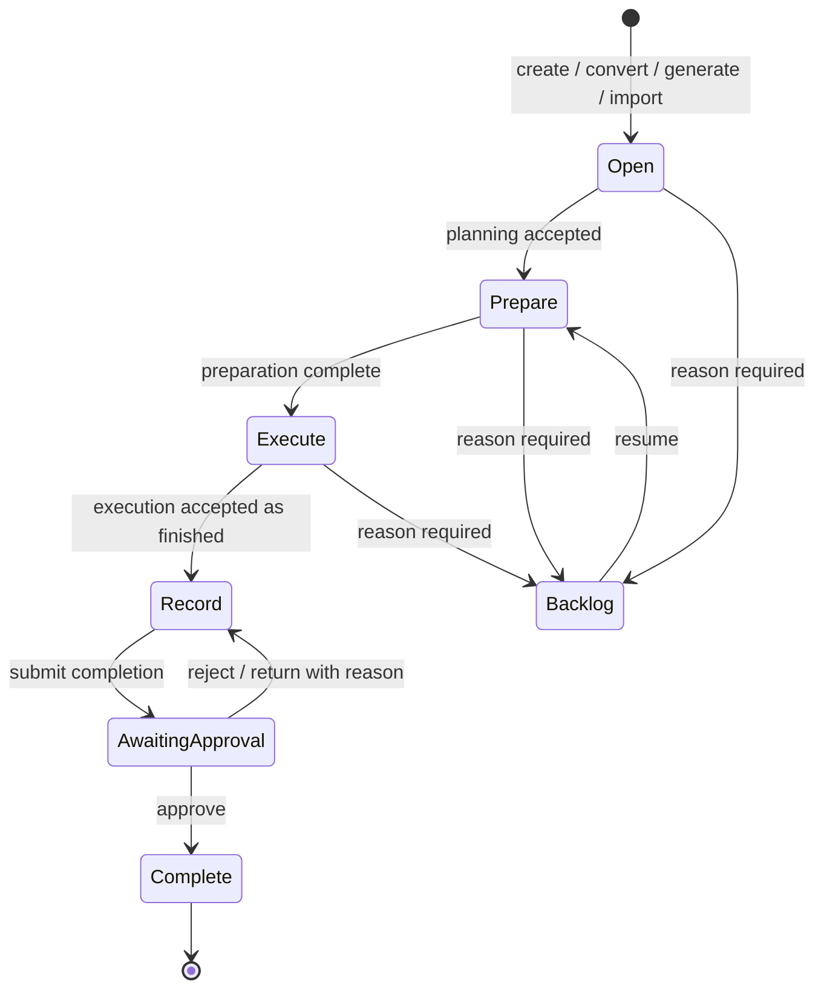

# Work Order workflow baseline

## Evidence hierarchy

1. FDS §4.5 defines the intended end-to-end process.
2. PHP demonstrates deployed screens and side effects but permits direct state writes and omits the documented final approval gate.
3. Existing MA Next corrective workflow is a partial vertical slice and is not the complete Work Order baseline.

This diagram is the FDS-aligned baseline, not a final enum definition. `Closed` versus `Completed`, cancellation, direct close, and per-step backlog require confirmation.

## State evidence

| Baseline state | Legacy/FDS evidence | Mandatory information | Expected side effects |
|---|---|---|---|
| Open | WO creation makes `woord010.stat=Open` and `woord050.stat=Open`. | Valid source if applicable, code, type, primary asset, title, priority, creator/update audit; assignment rules depend on source. | Open history, audit, assignment notification, link source record. |
| Prepare | FDS §4.5; `woord050/prepare`. | Planned assignment, schedule/estimate; materials/tools/expense/labor/documents as applicable. | Stage history/audit; notify responsible parties if assignment changes. |
| Execute | FDS §4.5; `woord010/execute`; `woord050/execute`. | Preparation requirements; execution acceptance/date/detail/note; safety/LOTO conditions where applicable. | Execute history/audit, notifications; begin actual timing. |
| Record | FDS §4.5. | Job steps/checklist completed as required; execution results, breakdown/damage/procedure/expense, completion data and evidence. | Draft/record history; no terminal source update yet. |
| Awaiting approval | FDS §4.5. | Complete record, mandatory checklist, required evidence, submitter. | Submission history/audit; notify supervisor. |
| Complete | FDS approval outcome; PHP uses `Completed`. | Approval by authorized person; approval actor/time/result. | Completion history/audit, source notification completion, shutdown task/project roll-up, material expense/contract effects, notifications. |
| Backlog | PHP header status/reason; FDS per-step backlog. | Reason (and likely note/date/actor); current step/WO scope. | Backlog history/audit and stakeholder notification; preserve previous/resume state. |
| Closed | Legacy list route and portal terminology, while code usually writes Completed. | `NEEDS_CONFIRMATION`. | `NEEDS_CONFIRMATION`. |

## Transition contract

Every target transition must be one service command with optimistic/current-state protection. It must reject a caller-supplied status patch.

| Command | Allowed source | Target | Permission (candidate) | Transition rules | Atomic side effects |
|---|---|---|---|---|---|
| `CREATE_MANUAL` | none | Open | `WORK_ORDER_CREATE` | Required header fields; active/valid asset; code uniqueness. | Header, source metadata, Open event, audit, assignment notification. |
| `CONVERT_NOTIFICATION` | approved notification | Open/Backlog | `WORK_ORDER_CREATE_FROM_NOTIFICATION` | Approved only; exactly one WO per notification; Backlog requires reason. | WO, reverse link, event, audit, assignee notification. |
| `GENERATE_PM` | eligible PM event | Open | system/`WORK_ORDER_GENERATE_PM` | Event due/eligible; idempotent source key; template snapshot. | WO, copied steps/docs/checklist, event link/history, notification. |
| `CONVERT_SHUTDOWN` | eligible task | Open | `WORK_ORDER_CREATE_SHUTDOWN` | Task not already linked; required asset/assignee fields. | WO, task reverse link, history/audit/notification. |
| `IMPORT` | import row | mapped state | `WORK_ORDER_IMPORT` | File/schema/value validation; owner-approved legacy fallback policy. | Upsert/quarantine, reconciliation and import audit. |
| `START_PREPARE` | Open/Backlog | Prepare | `WORK_ORDER_PLAN` | Backlog resume reason/history; planning minimums. | Event/audit, optional assignment notifications. |
| `START_EXECUTION` | Prepare | Execute | `WORK_ORDER_EXECUTE` | Assigned executor; preparation and acceptance/safety data complete. | Event/audit, start timestamp, notification. |
| `MOVE_TO_BACKLOG` | Open/Prepare/Execute or step | Backlog | `WORK_ORDER_BACKLOG` | Non-empty master reason and note as configured; capture resume state/scope. | Backlog entry/event/audit/notification. |
| `RESUME` | Backlog | prior/Prepare | `WORK_ORDER_BACKLOG` | Current backlog entry open; resume note if required. | Close backlog interval, event/audit/notification. |
| `SUBMIT_RECORD` | Execute/Record | Awaiting approval | `WORK_ORDER_COMPLETE` | Required job steps and checklist responses complete; result/duration/evidence; expenses/material valid. | Completion snapshot, event/audit, supervisor notification. |
| `REJECT_COMPLETION` | Awaiting approval | Record | `WORK_ORDER_VERIFY` | Reviewer differs from submitter if policy confirms; rejection reason required. | Review event/audit and submitter notification. |
| `APPROVE_COMPLETION` | Awaiting approval | Complete | `WORK_ORDER_VERIFY` | Valid completion and authority; no unresolved blockers. | Approval, terminal header/source updates, financial/project effects, event/audit/notifications. |
| `CANCEL` | `NEEDS_CONFIRMATION` | Cancelled | `NEEDS_CONFIRMATION` | Reason and reversal behavior unknown. | `NEEDS_CONFIRMATION`. |

## Child-state rules

- Job-step state evidence is Open and Completed; exact in-between values require data profiling.
- A WO cannot submit completion while any required step is incomplete. Legacy blocks any non-Completed step, without a distinct required flag.
- Checklist required questions must be answered; answer types and question notes are retained as snapshots.
- Backlog at job-step level must not overwrite header history; each reason should be append-only if FDS “unlimited” is confirmed.
- Materials, labor, documents and completion entries become correction-only/versioned after submission; physical deletion policy is `NEEDS_CONFIRMATION`.

## Failure behavior

- Invalid current state: HTTP/domain conflict; no writes.
- Missing permission: forbidden; security audit according to platform policy; no domain writes.
- Missing mandatory data: validation error with field/transition codes; no partial writes.
- Concurrent transition: conditional update/version conflict, safe retry/read refresh.
- Integration failure: use one database transaction for local changes; external inventory/notification/report work uses an outbox/idempotency key where not part of the same database.
- Notification delivery failure must not corrupt the workflow; log/retry it and retain the committed domain event.

## Known conflict with current target slice

Existing MA Next uses `OPEN`, `BACKLOG`, `IN_PROGRESS`, `COMPLETION_PENDING`, `VERIFIED`, `CLOSED`. This is useful corrective-flow code but does not preserve FDS Prepare/Execute/Record semantics or all sources. Phase 3 must reconcile rather than silently declaring the current enum authoritative.
