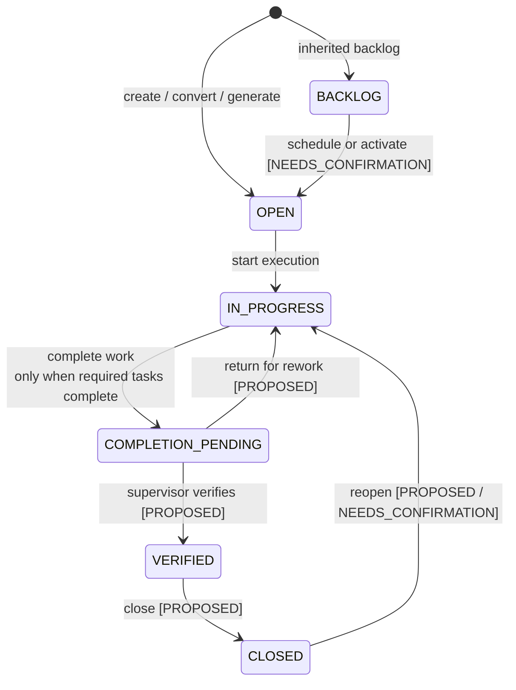
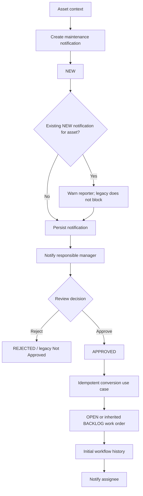
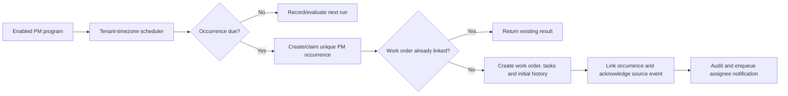

# MA Next workflow state model

## Purpose

All state transitions are centralized in domain workflow services. UI components, route handlers, Prisma repositories, imports and jobs may request a transition but may not assign workflow state directly.

The legacy system uses free-text and sometimes divergent states. The models below separate confirmed behavior from target proposals. Names or transitions marked `PROPOSED` require approval and must not be treated as discovered rules.

## Transition contract

Each transition definition declares:

- aggregate type, command and allowed source state(s);
- target state and legacy mapping(s);
- required permission and contextual policy;
- Zod command schema and domain preconditions;
- idempotency strategy and concurrency version;
- synchronous side effects inside the transaction;
- audit event, workflow history and outbox events;
- user-visible localized success/error codes.

The transition service returns a typed result. It writes the aggregate, append-only `workflow_transitions`, audit event and outbox rows in one Prisma transaction. External delivery occurs after commit.

## Work order workflow

Legacy evidence confirms `Open`, `Backlog`, execution-oriented lists/actions, prevention of completion while job steps remain incomplete, a completion record, and `Closed`. The baseline's requested vertical slice includes supervisor verification before close, but direct legacy evidence for a distinct `VERIFIED` state is incomplete.

| Command | From | To | Confirmed/proposed guards | Required event |
|---|---|---|---|---|
| `create` | none | `OPEN` or `BACKLOG` | valid source/asset/assignee; source conversion unique | `work_order.created` |
| `start` | `OPEN` | `IN_PROGRESS` | executable assignment and permission | `work_order.state_changed` |
| `complete` | `IN_PROGRESS` | `COMPLETION_PENDING` | every required job step completed; completion fields valid | `work_order.completed` |
| `return_for_rework` | `COMPLETION_PENDING` | `IN_PROGRESS` | PROPOSED supervisor note required | `work_order.returned` |
| `verify` | `COMPLETION_PENDING` | `VERIFIED` | PROPOSED eligible supervisor; completion remains valid | `work_order.verified` |
| `close` | `VERIFIED` | `CLOSED` | PROPOSED close permission and downstream callbacks idempotent | `work_order.closed` |
| `reopen` | `CLOSED` | approved state | NEEDS_CONFIRMATION reason and policy | `work_order.reopened` |

Cancellation, direct `Open → Closed`, assignment/backlog semantics, verification actor separation and downstream contract/project/survey effects require approval.

## Notification to work order flow

Notification transitions:

| Command | From | To | Rules |
|---|---|---|---|
| `create` | none | `NEW` | apply verified defaults; duplicate asset warning is non-blocking |
| `approve` | `NEW` | `APPROVED` | one authoritative reviewer decision; actor and note recorded |
| `reject` | `NEW` | `REJECTED` | target label maps legacy `Not Approved`; reason requirement needs approval |
| `convert` | `APPROVED` | remains `APPROVED` or `CONVERTED` | target display state needs approval; unique work-order link prevents duplicates |

Browser and legacy API conversion defects are not reproduced. Whether approval is required for all channels, backlog review behavior, edit-after-review and reopen/resubmit remain `NEEDS_CONFIRMATION`.

## Preventive maintenance generation

The unique key is proposed as `(tenant_id, program_id, scheduled_for)`. Scheduler frequency, timezone, generation horizon, missed-run/catch-up policy, plan-change behavior and cancellation require approval. A failed transaction must leave the occurrence retryable and must not acknowledge the source independently.

## Condition-based maintenance

Proposed states are `OPEN`, `ACKNOWLEDGED`, `CONVERTED`, `RESOLVED`, with exact mappings pending approval. The scanner reads quality-qualified telemetry through an adapter, evaluates a typed rule, records observed evidence, and deduplicates according to an approved key/window. It must degrade safely when telemetry is unavailable and must not create work directly outside the same conversion use case used by other channels.

## Approval workflow

An approval instance has `DRAFT`, `IN_REVIEW`, `APPROVED`, `RETURNED`, `REJECTED`, `CANCELLED`. Each step has `ON_HOLD`, `WAITING`, `APPROVED`, `RETURNED`, `REJECTED`, `SKIPPED`.

The target preserves ordered approval and history but replaces legacy SQL predicates/dynamic callbacks with:

- registered workflow type;
- typed applicability predicate;
- ordered step definition and eligible subject/role;
- registered finalization handler;
- transactionally appended decision history.

Delegation, substitutes, escalation, parallel steps, requester cancellation and coexistence with direct bulk approval need approval.

## Inventory document workflow

Proposed canonical states are `DRAFT → SUBMITTED → IN_REVIEW → APPROVED → POSTED`, with `RETURNED`, `REJECTED`, and `CANCELLED` exits before posting. `POSTED` is terminal; corrections create a new adjustment/reversal document and transaction.

Final approval requests inventory posting through one registered handler. Posting atomically validates availability, appends ledger lines, updates balance projection, records audit/outbox, and marks the document posted. Legacy `Completed` maps to target `POSTED` only after data profiling confirms semantic equivalence.

## Transition history

Every transition history record contains tenant, aggregate type/ID, command, from/to state, actor principal, acting employee if applicable, reason/note, occurred time, correlation/request ID, aggregate version, idempotency key, and structured non-sensitive metadata.

History is append-only and distinct from the general audit log: workflow history explains lifecycle; audit records broader data/security changes. Both are written when an important workflow command succeeds.

## Workflow decisions requiring approval

Approve ADR-008, ADR-009, ADR-010, ADR-013, ADR-014 and ADR-022 in the [architecture decision register](./target-architecture.md#architecture-decisions-requiring-approval), plus every target state/transition table, supervisor verification, close/reopen/cancel rules, backlog behavior, approval predicates and actors, PM scheduler semantics, CBM deduplication, inventory terminal/correction states, and downstream completion callbacks.

