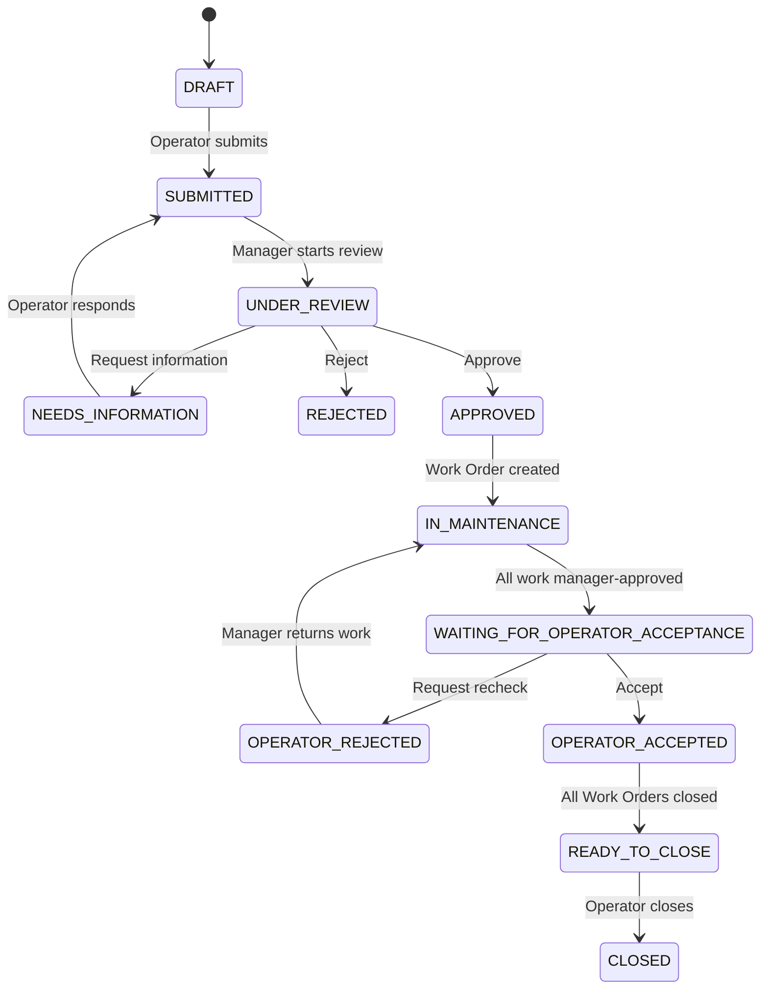
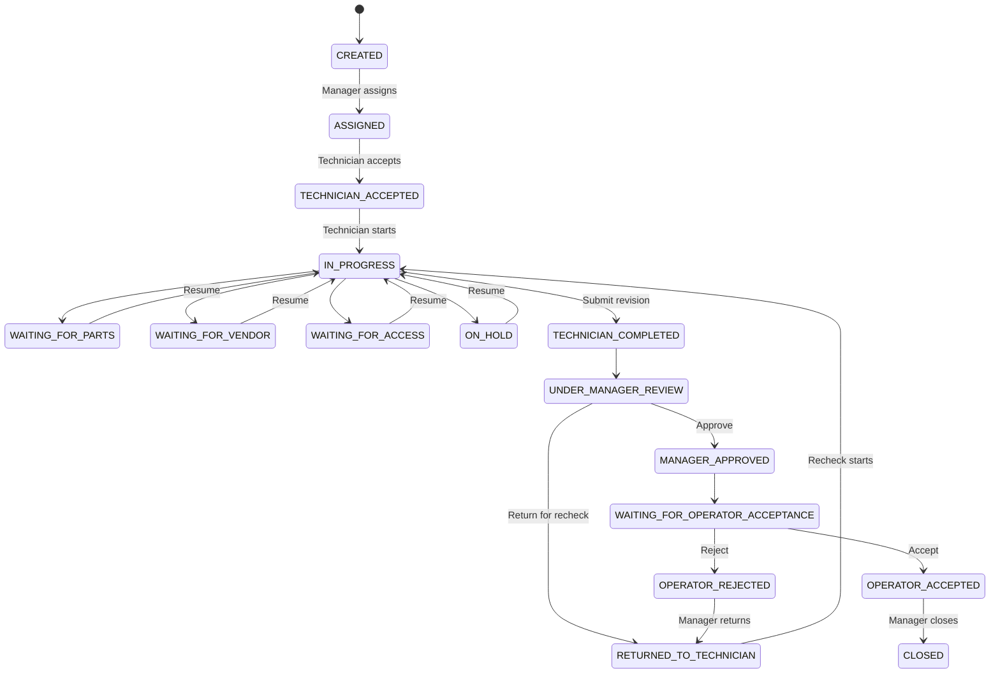

# Workflow status transitions

```mermaid
stateDiagram-v2
  [*] --> DRAFT
  DRAFT --> SUBMITTED: Operator submits
  SUBMITTED --> UNDER_REVIEW: Manager starts review
  UNDER_REVIEW --> NEEDS_INFORMATION: Request information
  NEEDS_INFORMATION --> SUBMITTED: Operator responds
  UNDER_REVIEW --> REJECTED: Reject
  UNDER_REVIEW --> APPROVED: Approve
  APPROVED --> IN_MAINTENANCE: Work Order created
  IN_MAINTENANCE --> WAITING_FOR_OPERATOR_ACCEPTANCE: All work manager-approved
  WAITING_FOR_OPERATOR_ACCEPTANCE --> OPERATOR_REJECTED: Request recheck
  OPERATOR_REJECTED --> IN_MAINTENANCE: Manager returns work
  WAITING_FOR_OPERATOR_ACCEPTANCE --> OPERATOR_ACCEPTED: Accept
  OPERATOR_ACCEPTED --> READY_TO_CLOSE: All Work Orders closed
  READY_TO_CLOSE --> CLOSED: Operator closes
```

```mermaid
stateDiagram-v2
  [*] --> CREATED
  CREATED --> ASSIGNED: Manager assigns
  ASSIGNED --> TECHNICIAN_ACCEPTED: Technician accepts
  TECHNICIAN_ACCEPTED --> IN_PROGRESS: Technician starts
  IN_PROGRESS --> WAITING_FOR_PARTS
  IN_PROGRESS --> WAITING_FOR_VENDOR
  IN_PROGRESS --> WAITING_FOR_ACCESS
  IN_PROGRESS --> ON_HOLD
  WAITING_FOR_PARTS --> IN_PROGRESS: Resume
  WAITING_FOR_VENDOR --> IN_PROGRESS: Resume
  WAITING_FOR_ACCESS --> IN_PROGRESS: Resume
  ON_HOLD --> IN_PROGRESS: Resume
  IN_PROGRESS --> TECHNICIAN_COMPLETED: Submit revision
  TECHNICIAN_COMPLETED --> UNDER_MANAGER_REVIEW
  UNDER_MANAGER_REVIEW --> RETURNED_TO_TECHNICIAN: Return for recheck
  RETURNED_TO_TECHNICIAN --> IN_PROGRESS: Recheck starts
  UNDER_MANAGER_REVIEW --> MANAGER_APPROVED: Approve
  MANAGER_APPROVED --> WAITING_FOR_OPERATOR_ACCEPTANCE
  WAITING_FOR_OPERATOR_ACCEPTANCE --> OPERATOR_REJECTED: Reject
  OPERATOR_REJECTED --> RETURNED_TO_TECHNICIAN: Manager returns
  WAITING_FOR_OPERATOR_ACCEPTANCE --> OPERATOR_ACCEPTED: Accept
  OPERATOR_ACCEPTED --> CLOSED: Manager closes
```

The transition tables live in `lib/maintenance/workflow.ts`. Clients submit action names, never target statuses.

